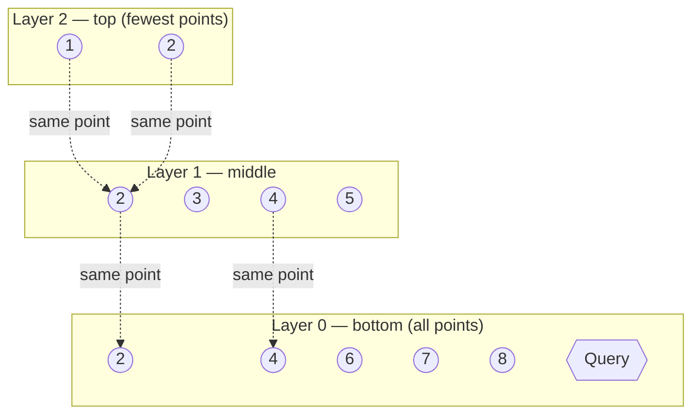
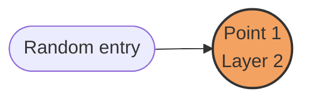
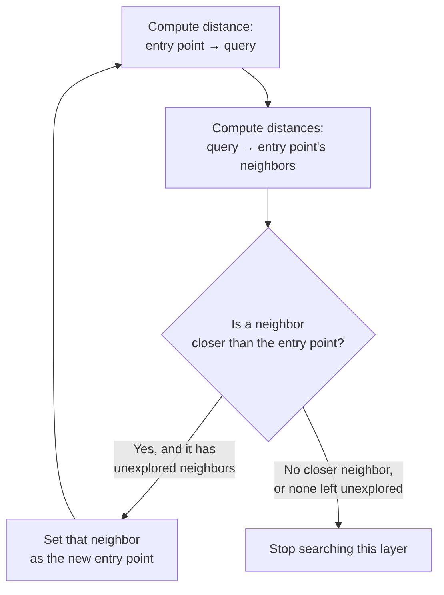
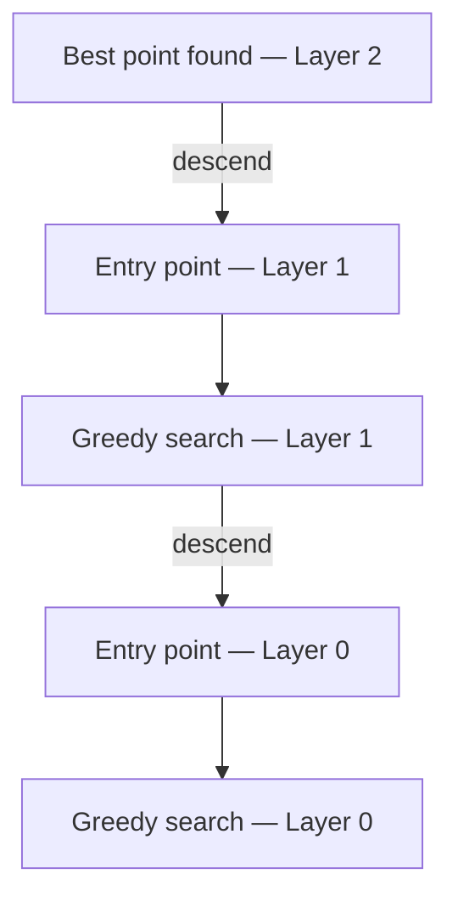
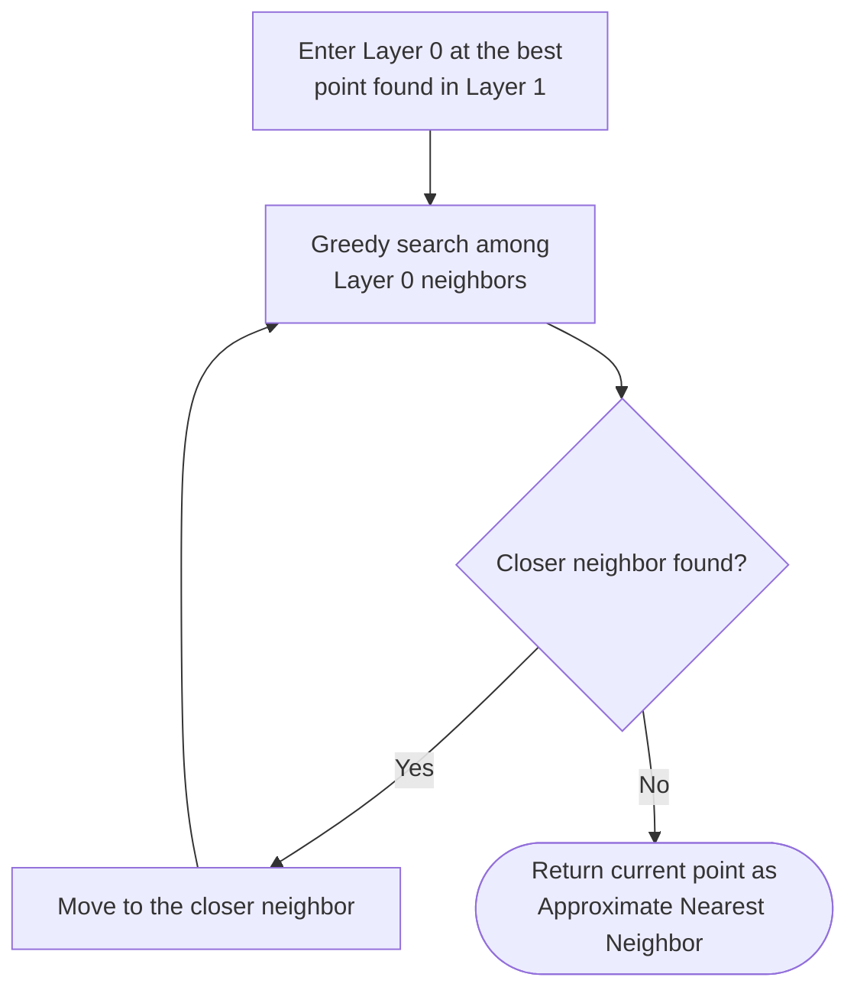

# Hierarchical Navigable Small World (HNSW) — Cheat Sheet

---

## Table of Contents

- [What Is HNSW?](#what-is-hnsw)
- [Building Block 1: Small World Networks](#building-block-1-small-world-networks)
- [Building Block 2: Navigable Networks](#building-block-2-navigable-networks)
- [Building Block 3: Hierarchical Structure](#building-block-3-hierarchical-structure)
- [How HNSW Search Works — Step by Step](#how-hnsw-search-works--step-by-step)
- [How the HNSW Index Is Built](#how-the-hnsw-index-is-built)
- [Key Parameters](#key-parameters)
- [Why This Works](#why-this-works)
- [Time Complexity](#time-complexity)
- [Trade-offs and Limitations](#trade-offs-and-limitations)
- [The Science Behind HNSW](#the-science-behind-hnsw)
- [When to Use / Avoid HNSW](#when-to-use--avoid-hnsw)
- [Key Takeaways](#key-takeaways)

---

## What Is HNSW?

Think of navigating a huge city with a smart map app: you start zoomed out on major highways, then progressively zoom in through smaller streets until you reach your exact destination. **Hierarchical Navigable Small World (HNSW)** works the same way, but instead of finding restaurants, it finds similar data points in massive databases.

HNSW is a **graph-based approximate nearest neighbor (ANN) search algorithm** designed to quickly find items similar to a query, especially in **high-dimensional data** — sentence meanings, image features, audio patterns, and similar embeddings.

It was introduced in a 2016 paper by **Yu. A. Malkov and D. A. Yashunin**, *"Efficient and robust approximate nearest neighbor search using Hierarchical Navigable Small World graphs"* (arXiv:1603.09320), later published in IEEE Transactions on Pattern Analysis and Machine Intelligence.

---

## Building Block 1: Small World Networks

Just as any two people are connected by roughly six degrees of separation, a **small-world network** lets you reach any node from any other node in relatively few steps. This concept was formalized by **Duncan Watts and Steven Strogatz** in their influential 1998 paper.

Small-world networks have two key characteristics:

| Property | Description |
|---|---|
| **High clustering coefficient** | Nodes form tight-knit groups with many connections between neighbors |
| **Low average path length** | Despite clustering, any node can be reached from any other node in just a few steps |

HNSW applies this principle to data: instead of people knowing people, data points are "connected" to similar data points, forming a network navigable quickly from any point to any other.

---

## Building Block 2: Navigable Networks

A **navigable network** doesn't just have random connections — it has smart connections that guide movement toward a target, like road signs pointing toward a destination.

The **Navigable Small World (NSW)** algorithm, HNSW's foundation, works via **greedy routing**:

1. Start at an entry point in the graph.
2. Look at all directly connected neighbors.
3. Move to the neighbor closest to the target.
4. Repeat until no closer neighbor can be found.

This greedy search has **polylogarithmic time complexity**, `O(log^k n)` — significantly faster than a naive linear search through all data points.

---

## Building Block 3: Hierarchical Structure

Instead of a single network, HNSW builds **multiple layers**, like a skyscraper with different floors. The concept is inspired by **skip lists** — a probabilistic data structure maintaining multiple levels of linked lists.

| Layer | Description |
|---|---|
| **Top floor** | Very few data points, connected by long-distance links that jump far across the data space — like express highways. Only about `1/2^L` of nodes appear at layer `L`; probability decreases exponentially with height. |
| **Middle floors** | More points, medium-distance connections — like main roads. |
| **Ground floor (Layer 0)** | Contains **every** data point in the dataset, with short-distance connections — the local streets where the exact destination is found. |

Each node's layer assignment is chosen **probabilistically**, following an exponentially decaying distribution — similar to how skip lists assign height.

---

## How HNSW Search Works — Step by Step

The bottom layer (Layer 0) holds all data points (embeddings); the query is also an embedding. A subset of points is also projected onto higher layers, with fewer points at each successive layer. Identical points are linked across layers, but a layer's connections don't necessarily mirror the layer below it.

### Step 1 — Start with the HNSW Index

The index is a multi-layer graph. Higher layers hold fewer points connected by long-range links; the bottom layer holds every point. The query is compared against this structure to find its approximate nearest neighbor.

### Step 2 — Enter at a Random Point in the Top Layer

Search begins at a randomly selected entry point in the highest layer.

### Step 3 — Perform Greedy Search in the Current Layer

### Step 4 — Move Down One Layer and Repeat

Descend to the next layer using the best point found so far as the new entry point, then repeat Step 3. Already-computed distances are reused; only newly encountered neighbors need new distance computations.

### Step 5 — Final Search in the Bottom Layer, Then Return the Result

At Layer 0, one last greedy search runs among all remaining neighbors. When no closer point remains, the search terminates and the current point is returned as the **approximate nearest neighbor**.

### Worked Example

With 12 total data points, a brute-force search would require 12 distance computations. Walking down through the layers with greedy routing found the nearest neighbor using only **8 distance computations** — fewer comparisons than brute force, with the gap widening substantially on larger, real-world datasets.

> **Note:** HNSW does not guarantee the *exact* nearest neighbor, since greedy routing can settle into a local minimum — but it typically finds a very close match.

---

## How the HNSW Index Is Built

Think of building a smart city map where every building (data point) connects to others to enable fast routing.

**Step 1 — Start with an empty graph.**
The first inserted point becomes the entry point for all future insertions and searches.

**Step 2 — Assign a height (layer) to each data point.**
Each point's height is chosen randomly, but taller "buildings" are rarer — following an **exponentially decreasing probability distribution**:
- Most points appear only at Layer 0 (ground floor).
- Progressively fewer points appear at Layer 1, 2, 3, and so on.

This layering lets the algorithm zoom from a broad overview down to fine detail.

**Step 3 — Insert the point into the graph:**

a. **Start at the top layer** — begin at the highest layer where the current entry point exists; run greedy search (move to the neighbor closest to the new point) until no closer neighbor exists in that layer.

b. **Move down one layer** — repeat greedy search starting from the best point found in the layer above.

c. **Connect to neighbors** — at each layer from the top down to the ground floor, the new point connects to its `M` closest neighbors. Connections are **bidirectional**, forming the small-world network that enables fast traversal.

**Step 4 — Repeat for every point.**
Each new point is assigned a height, searched in from the top, and connected to neighbors at every level it participates in — gradually building a multi-layered graph optimized for fast search.

---

## Key Parameters

| Parameter | Role | Effect |
|---|---|---|
| **M** — max connections per node | Controls how many neighbors each point connects to | Higher `M` → better accuracy, more memory usage. Lower `M` → faster build, less memory, lower accuracy |
| **efConstruction** — search breadth during build | Controls how many candidates are considered when finding neighbors during insertion | Higher → better graph quality, slower build. Lower → faster build, possibly lower later search quality |
| **efSearch** — search breadth during querying | Controls how many candidate nodes are explored during a query | Higher → better accuracy, slower search. Lower → faster search, may miss best matches. **This is the main knob for tuning speed vs. accuracy at query time.** |
| **ml** — level multiplier | Affects how likely a point is to appear in higher layers | Controls the shape of the hierarchy (more/fewer "tall buildings") |

### Tuning Guidelines

- Start with default values: `M = 16`, `efConstruction = 200`.
- Increase `M` for higher recall (up to around `M = 64`).
- Adjust `efSearch` based on speed/accuracy requirements at query time.
- Use benchmarking tools to find optimal settings for your dataset and workload.

---

## Why This Works

- **Top layers** enable big jumps across the data space — like highways.
- **Bottom layer** provides fine-grained detail — like local streets.
- The combination makes HNSW both fast and accurate, even for huge datasets:
  1. Start at the top layer — few, strategically connected points with long-range links.
  2. Navigate toward the target via greedy routing — jump to whichever neighbor is closest to the query.
  3. Move down a layer once no closer neighbor exists in the current layer (a local minimum is reached).
  4. Repeat — navigate, then descend — until the bottom layer is reached.
  5. Perform a final greedy search at Layer 0 to return the best match(es); multiple approximate nearest neighbors can be returned if requested.

---

## Time Complexity

The hierarchical structure enables **logarithmic search complexity, `O(log n)`**, compared to **linear `O(n)`** for brute-force search.

---

## Trade-offs and Limitations

### Approximate Results
HNSW is fast and accurate but may occasionally miss the true nearest neighbor. Typical **recall rates range from 90% to 99%**. For most applications, this trade-off is worthwhile.

### Parameter Tuning
Requires adjusting `M`, `efConstruction`, `efSearch`, and `ml` to balance recall, speed, memory, and build time (see [Key Parameters](#key-parameters)).

### Dynamic Updates
HNSW is best suited for **mostly-static datasets**. Frequent insertions and deletions can:
- **Degrade performance** — the graph becomes less optimal over time.
- **Require rebuilding** — periodic reconstruction may be needed for optimal performance.
- **Increase complexity** — dynamic updates require careful synchronization.

### Distance Metric Limitations
HNSW supports various distance metrics but performs best with:
- **Euclidean distance (L2)**
- **Cosine similarity**
- Other metrics may require modification or perform suboptimally.

---

## The Science Behind HNSW

### Original Research
HNSW was developed by **Yu. A. Malkov and D. A. Yashunin** (2016), published on arXiv (arXiv:1603.09320) and later in IEEE Transactions on Pattern Analysis and Machine Intelligence. It has become one of the most influential works in similarity search, cited over 2,000 times in academic literature.

### Key Innovation
HNSW combines two existing concepts:

- **Skip Lists** — a probabilistic data structure invented by **William Pugh** (1989) enabling fast search via multiple levels of links.
- **Navigable Small World Networks** — networks reachable quickly via smart connections, building on **Kleinberg's** work on navigable networks.

### Mathematical Foundation

| Property | Explanation |
|---|---|
| **Search complexity** | Hierarchical structure enables logarithmic search complexity `O(log n)`, vs. linear `O(n)` for brute force |
| **Connection strategy** | At each layer, nodes connect to their `M` closest neighbors, a tunable parameter affecting accuracy and memory |
| **Greedy search guarantee** | The algorithm reaches a local minimum at each layer; the hierarchical structure increases the probability this local minimum is close to the global optimum |

### Theoretical Properties

- **Scale separation** — upper layers provide "highway" connections for long-distance jumps.
- **Polylogarithmic complexity** — search time scales as `O(log^k n)`, with `k` typically small.
- **High-probability guarantees** — mathematical proofs show a high probability of finding near-optimal results.

---

## When to Use / Avoid HNSW

### Use HNSW when you need:
- Fast similarity search in large datasets
- Good accuracy with reasonable speed
- To handle high-dimensional data (many features)
- Scalable solutions that work as data grows

### Consider alternatives when:
- You need **guaranteed exact** results
- Your dataset is very small (simpler traditional methods may suffice)
- Memory usage is a critical constraint
- You need to **frequently add or remove data** (HNSW is optimized for mostly-static datasets)

---

## Key Takeaways

- ✅ HNSW is a graph-based **approximate nearest neighbor** algorithm built on small-world networks, navigable routing, and a skip-list-inspired hierarchical structure.
- ✅ Search proceeds top-down: greedy routing finds the closest point in each layer, then descends — from coarse "highway" jumps at the top to fine-grained detail at Layer 0.
- ✅ The index is built the same way it's searched: each new point is inserted via greedy search from the top layer down, connecting to its `M` closest neighbors at every layer it participates in.
- ✅ `efSearch` is the primary lever for trading off query speed against accuracy; `M` and `efConstruction` primarily shape build-time quality, memory, and recall.
- ✅ Search complexity is `O(log n)`, dramatically faster than brute-force `O(n)`, at the cost of only approximate (typically 90–99% recall) results.
- ✅ HNSW works best on **mostly-static, high-dimensional datasets** using Euclidean or cosine distance — it's less suited to frequently-updated data or workloads that require guaranteed exact results.
