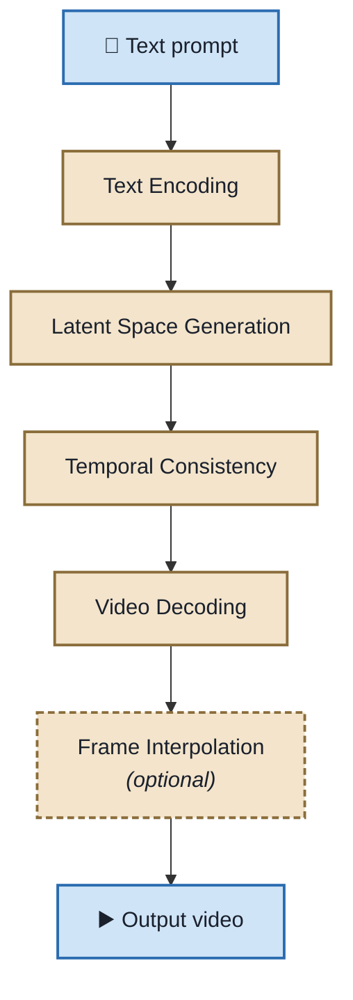
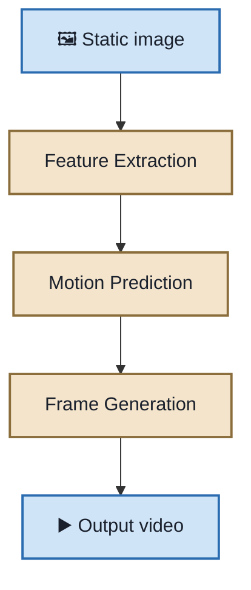

# Introduction to Text-to-Video and Image-to-Video Technologies

> **Topic:** How generative AI turns written prompts and static images into coherent video

---

## Learning objectives

After completing this reading, you will be able to:

- Understand the core components of text-to-video and image-to-video AI technologies
- Analyze the capabilities and technical workings of these systems
- Evaluate the applications, benefits, and challenges associated with these technologies

---

## Table of Contents

- [Introduction](#introduction)
- [Text-to-Video Technology](#text-to-video-technology)
- [Text-to-Video Models](#text-to-video-models)
- [Image-to-Video Technology](#image-to-video-technology)
- [Image-to-Video Models](#image-to-video-models)
- [Applications and Considerations](#applications-and-considerations)
- [Real-World Applications](#real-world-applications)
- [Challenges](#challenges)
- [Future Directions](#future-directions)
- [Key Takeaways](#key-takeaways)
- [Next Steps](#next-steps)

---

## Introduction

In the evolving landscape of artificial intelligence, the ability to generate videos from textual descriptions or static images marks a significant milestone. Text-to-video and image-to-video technologies harness advanced machine learning models to automate video creation, transforming how content is produced across various industries.

---

## Text-to-Video Technology

Text-to-video models convert written prompts into coherent video sequences. The pipeline has five stages, the last one optional:

### 1. Text encoding

The input text is processed using language models to extract semantic meaning, resulting in a **high-dimensional vector representation** that captures the essence of the prompt.

### 2. Latent space generation

The semantic vector guides a **diffusion model** to generate a sequence of latent representations corresponding to video frames. Diffusion models start with random noise and iteratively refine it to produce meaningful content.

### 3. Temporal consistency

To ensure smooth transitions between frames, models incorporate temporal modules:

| Module | How it works |
|---|---|
| **3D U-Nets** | Extend traditional U-Nets to handle spatiotemporal data, capturing both spatial details and temporal dynamics |
| **Transformers** | Use self-attention mechanisms to model dependencies across frames, maintaining consistency in motion and appearance |

### 4. Video decoding

The refined latent representations are decoded into actual video frames using a decoder network, often a **convolutional neural network (CNN)**. The result is a coherent video that aligns with the original text prompt.

### 5. Frame interpolation (optional)

To enhance video smoothness, some models apply **frame interpolation** techniques, generating intermediate frames between keyframes to achieve higher frame rates.

---

## Text-to-Video Models

| Model | Release Date | Features / Capabilities | Access |
|---|---|---|---|
| **OpenAI Sora** | Dec 2024 | Generates 60s videos from prompts; complex scenes, camera motion; diffusion-based 3D patch generation | Available to ChatGPT Plus and Pro subscribers |
| **Google Veo 2** | Apr 2025 | 8s, 720p videos; cinematic quality; strong motion/physics modeling; integration with Gemini Advanced | Available through Gemini Advanced and Google One AI Premium |
| **Runway Gen-4** | Apr 2025 | Consistent characters, better storytelling control; real-world aesthetics | Available to paid and enterprise users |
| **MiniMax Hailuo T2V-01-Director** | Jan 2025 | High control over scene motion and video generation randomness | Part of the Hailuo AI platform |
| **Step-Video-T2V** | Feb 2025 | 30B parameters; Video-VAE; 204-frame long video generation | Open-source; available on GitHub |
| **AMD Hummingbird** | Mar 2025 | Lightweight; 31x speedup; only 4 GPUs needed to train | Open-source; optimized for resource-limited devices |

---

## Image-to-Video Technology

Image-to-video models animate static images by predicting plausible motion, creating dynamic video sequences.

| Stage | What happens |
|---|---|
| **Feature extraction** | CNN pulls out edges, textures, and semantic content |
| **Motion prediction** | Optical flow or latent flow models estimate trajectories |
| **Frame generation** | GAN / VAE synthesizes frames by warping the source image |
| **Video assembly** | Frames compiled, then stabilized and color-corrected |

### 1. Feature extraction

The input image is analyzed to extract key features — such as edges, textures, and semantic content — using CNNs or other feature extractors.

### 2. Motion prediction

Based on the extracted features, the model predicts motion trajectories:

| Technique | How it works |
|---|---|
| **Optical flow estimation** | Determines pixel-level motion between frames, guiding the animation process |
| **Latent flow models** | Generate motion in a compressed latent space, improving computational efficiency and temporal coherence |

### 3. Frame generation

Using the predicted motion, the model synthesizes new frames by warping the original image accordingly. This can involve:

| Approach | Role |
|---|---|
| **Generative adversarial networks (GANs)** | Generate realistic frames by training a generator–discriminator pair |
| **Variational autoencoders (VAEs)** | Model the distribution of possible frames, allowing for diverse and coherent outputs |

### 4. Video assembly

The generated frames are compiled into a video sequence, often with post-processing steps such as **stabilization** and **color correction** to enhance visual quality.

---

## Image-to-Video Models

| Model | Release Date | Features / Capabilities | Access |
|---|---|---|---|
| **OpenAI Sora** | Dec 2024 | Supports image-to-video generation; animates static images into dynamic videos with realistic motion and scene transitions | Available to ChatGPT Plus and Pro subscribers |
| **Google Whisk Animate** | Apr 2025 | Converts still images to 8s, 720p videos with animation and scene expansion | Available to Google One AI Premium subscribers |
| **I2V3D** | Mar 2025 | Adds 3D camera movement and object rotation; geometry-aware animation | Open-source; code to be released publicly |
| **MiniMax Hailuo I2V-01-Director** | Jan 2025 | High control over generated motion from single images | Part of the Hailuo AI platform |

---

## Applications and Considerations

The adoption of text-to-video and image-to-video technologies offers numerous benefits:

| Benefit | Description |
|---|---|
| **Efficiency** | Reduces the time and resources needed for video production |
| **Accessibility** | Enables individuals without technical expertise to create professional-quality videos |
| **Versatility** | Applicable across various industries, including entertainment, education, and advertising |

However, challenges such as ensuring content accuracy, managing ethical considerations, and addressing potential misuse remain critical areas for ongoing development.

---

## Real-World Applications

These technologies are already transforming various industries:

**Marketing and advertising**

- Rapid creation of promotional videos, product showcases, and personalized ads
- Enables brands to produce multilingual and localized content at scale

**Education and e-learning**

- Development of instructional videos, animated tutorials, and interactive learning materials
- Facilitates the creation of content tailored to diverse learning styles and languages

**Entertainment and media production**

- Assists in generating storyboards, visual effects, and background scenes
- Used in music videos and concerts for dynamic visualizations, as seen in Madonna's performances

**Social media and content creation**

- Empowers influencers and creators to produce engaging short-form videos for platforms such as TikTok, Instagram, and YouTube
- Supports the generation of memes, animated GIFs, and other viral content

**Corporate training and internal communications**

- Creation of onboarding videos, policy explainers, and internal announcements
- Enhances employee engagement through visually rich content

---

## Challenges

Despite significant progress, several challenges remain:

**Computational complexity**

- High resource requirements for training and inference, limiting accessibility for smaller organizations
- Longer video durations and higher resolutions demand significant processing power

**Temporal and spatial coherence**

- Maintaining consistency in object appearance and motion across frames remains difficult
- Issues such as flickering, unnatural transitions, and inconsistent lighting are common

**Data limitations**

- Need for large, high-quality, and diverse datasets to train models effectively
- Challenges in obtaining annotated video data for supervised learning

**Ethical and legal concerns**

- Potential misuse for creating deepfakes, misinformation, or unauthorized content
- Uncertainties around copyright, consent, and the use of proprietary data

**Interpretability and control**

- Difficulty in understanding and directing the behavior of complex generative models
- Limited user control over specific aspects of the generated video content

---

## Future Directions

**Enhanced model efficiency**

- Development of more efficient architectures to reduce computational demands
- Optimization for deployment on edge devices and real-time applications

**Improved content control**

- Advancements in prompt engineering and user interfaces to allow finer control over output
- Incorporation of feedback mechanisms for iterative refinement of generated videos

**Multimodal integration**

- Combining text, image, audio, and video inputs for richer content generation
- Facilitating more immersive experiences in virtual and augmented reality environments

**Ethical frameworks and regulations**

- Establishment of guidelines and standards for responsible use of generative video technologies
- Implementation of watermarking and content verification systems to combat misuse

**Personalized and adaptive content**

- Leveraging user data to generate personalized video content for education, marketing, and entertainment
- Adaptive storytelling that responds to viewer preferences and interactions

---

## Key Takeaways

| Aspect | Text-to-Video | Image-to-Video |
|---|---|---|
| **Input** | Written prompt | Static image |
| **First stage** | Text encoding into a semantic vector | Feature extraction (edges, textures, semantics) |
| **Core generative engine** | Diffusion in latent space | Motion prediction + frame synthesis (GAN / VAE) |
| **Consistency mechanism** | 3D U-Nets, transformer self-attention | Optical flow / latent flow models |
| **Output stage** | CNN decoding, optional frame interpolation | Frame assembly, stabilization, color correction |
| **Typical strength** | Creating a scene from nothing | Preserving a given subject while adding motion |

- Both families share a common backbone: encode the input, generate or predict motion in a compressed latent space, then decode to frames.
- **Temporal coherence** — not single-frame image quality — is the hardest technical problem in video generation.
- Benefits center on **efficiency, accessibility, and versatility**; risks center on **compute cost, deepfakes, and copyright**.
- The current model landscape splits between **closed subscription products** (Sora, Veo 2, Runway Gen-4) and **open-source releases** (Step-Video-T2V, AMD Hummingbird, I2V3D).

---

## Next Steps

As you continue your journey in multimodal AI, understanding these video-generation technologies will be essential. In labs, you'll explore how to implement these technologies, combine them with other modalities, and create more natural and effective AI systems.
