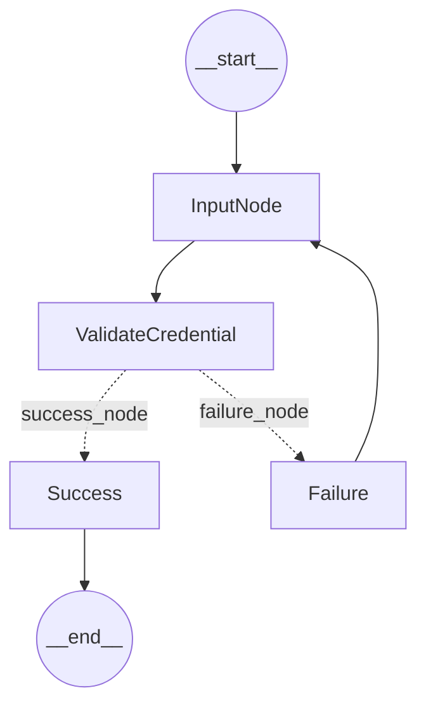

# LangGraph versus LangChain: Pros, Cons, and Practical Considerations

## Introduction

Recent developments in AI have produced powerful frameworks for building applications around large language models (LLMs). LangChain (released 2022) and LangGraph (released 2023) are two such frameworks from LangChain Inc.

They take different approaches:

- **LangChain** uses a linear "chain" of components (prompts, models, tools).
- **LangGraph** uses a graph-based orchestration of stateful, multi-agent workflows.

In practice, LangChain is ideal for straightforward, sequential tasks (for example, a simple QA or RAG pipeline), whereas LangGraph is designed for complex, adaptive systems (for example, coordinating multiple AI agents, maintaining long-term context, or human-in-the-loop approval).

## What is LangChain?

LangChain is an open-source framework for developing LLM-driven applications. It provides tools and APIs (in Python and JavaScript) to simplify building chatbots, virtual assistants, Retrieval-Augmented Generation (RAG) pipelines, and other LLM-based workflows. At its core, LangChain uses a "chain" or directed graph structure: you define a sequence of steps (prompts → model calls → outputs) that execute in order.

For example, a RAG workflow might chain: (1) retrieve relevant documents, (2) summarize, (3) generate an answer. The LangChain ecosystem includes prebuilt components for prompts, memory buffers, tools (such as search or calculator), and agents that can pick actions. It also integrates with dozens of LLM providers. LangChain's flexible, modular design has made it popular for quickly prototyping AI apps with minimal coding.

The LangChain framework is layered: a core of abstractions (chat models, vectors, tools), surrounded by higher-level chains and agents that implement workflows.

LangChain's architecture is modular. The base `langchain-core` defines interfaces for models, prompts, memory and tools. The main `langchain` package adds chains and agents that form the "cognitive architecture". Popular LLM providers (OpenAI, Google, etc.) have their own integration packages, making it easy to switch models. There is also a `langchain-community` package for third-party extensions. Overall, LangChain serves as a high-level orchestration layer for LLMs and data. It handles inputs/outputs and connects components, but it remains mostly stateless by default (conversation histories can be passed, but long-term memory must be explicitly managed).

## What is LangGraph?

LangGraph is a newer framework (built by the same team) focused on stateful multi-agent orchestration. LangGraph is an extension of LangChain aimed at building robust and stateful multi-actor applications with LLMs by modeling steps as edges and nodes. In simple terms, while LangChain chains operations, LangGraph lets you build a graph of agents and tools. Each node in the graph can be an LLM call or an agent (with its own prompt, model, and tools), and edges define how data and control flow between them. This architecture natively supports loops, branches, and complex control flows.

LangGraph is explicitly designed for long-running, complex workflows. Its core benefits include durable execution (agents can pause and resume after failures), explicit human-in-the-loop controls, and persistent memory across sessions. For instance, LangGraph provides "comprehensive memory" that records both short-term reasoning steps and long-term facts. It even offers built-in inspection and rollback features so developers can "time-travel" through an agent's state to debug or adjust its course. In practice, LangGraph is used to build applications where many agents work together — for example, one agent might retrieve documents, another summarizes them, a third plans next steps, etc. These agents communicate using shared "state" (a kind of global memory) and can be arranged hierarchically or in parallel. Major companies (LinkedIn, Uber, Klarna, and so on) have begun using LangGraph to build sophisticated agentic applications in production.

Think of LangGraph as a toolkit for creating smart assistants. These assistants don't just follow instructions — they understand what you want, figure out the best way to achieve it, and carry out the tasks automatically. By using LangGraph, you can design AI systems that are structured, adaptable, and capable of handling everything from simple workflows to complicated problem-solving tasks.

### Why LangGraph?

LangGraph offers unique advantages for building intelligent AI agents, especially when compared to frameworks such as LangChain. One of its standout features is the ability to create **cyclic graphs** in addition to Directed Acyclic Graphs (DAGs).

**Support for cyclic graphs**

Although tools such as LangChain are limited to DAGs — where tasks must follow a strict, linear flow without loops — LangGraph allows for cyclic graphs, where tasks can revisit earlier steps. This is crucial for workflows that require iterative processes, feedback loops, or retries. For example:

- An AI agent analyzing customer feedback might revisit earlier steps to refine its understanding based on new data.
- A process for refining a document might loop through draft, review, and revise steps multiple times.

**Enhanced workflow flexibility**

Cyclic graphs make LangGraph ideal for real-world scenarios where tasks don't always follow a one-way path. It can handle dynamic workflows where agents need to adapt, reevaluate, or repeat steps as needed, providing greater flexibility.

**Powerful iterative processes**

By enabling loops, LangGraph supports processes such as optimization, data refinement, or real-time adjustments, ensuring the AI agent delivers more accurate and meaningful results.

**All-in-one solution**

LangGraph doesn't just manage tasks but also integrates the benefits of both DAGs (for structured flows) and cyclic graphs (for iterative workflows). This makes it a more versatile framework for designing intelligent, adaptable AI agents.

With LangGraph, you're not constrained by one-way task flows. Its support for cyclic graphs allows you to model more complex, real-world problems with ease, making it a go-to choice for AI development.

### Components of LangGraph

LangGraph's strength lies in its structured and intuitive design, composed of essential building blocks that enable the creation of intelligent AI agents, with default stages denoting the start and end of a workflow.

The example below walks through a simple **authentication workflow** built with these components, ending in the following graph:



#### 1. States

States represent the current condition or context within a workflow. They store and manage information as the agent progresses from one node to the next.

For instance, a state might capture user input, store the results of a database query, or reflect the status of an ongoing process. States ensure the AI agent has access to relevant information at the right time, enabling dynamic and context-aware behavior.

**Example: `AuthState`**

Using `from typing import TypedDict, Optional`, the `AuthState` class is defined as a `TypedDict` that specifies the structure of a dictionary representing a user's authentication state. Each key has a specific type, and all fields are optional (`Optional`), meaning they can either hold a value of the specified type or be `None`.

```python
from typing import TypedDict, Optional


class AuthState(TypedDict):
    username: Optional[str]
    password: Optional[str]
    is_authenticated: Optional[bool]
    output: Optional[str]
```

State keys and types:

- `username: Optional[str]` — The user's username; it can be a string or `None`.
- `password: Optional[str]` — The user's password; it can be a string or `None`.
- `is_authenticated: Optional[bool]` — Indicates whether the user is authenticated; it can be a boolean or `None`.
- `output: Optional[str]` — A message or result related to authentication; it can be a string or `None`.

This structure ensures that the authentication state is consistently defined and type-safe, while also accommodating scenarios where some fields may be unavailable or unused.

#### 2. Nodes

Nodes are the core units of action in LangGraph. Each node represents a specific task or operation that the AI agent needs to perform — for example, fetching data from an API, processing information, or generating a response. Nodes can vary in complexity, from simple calculations to executing intricate workflows, and they form the foundation of any graph in LangGraph.

**The input node**

The `input_node` collects the user's username and password if they are not already provided in the state. This node ensures that the state is populated with the necessary input for authentication, and it is usually the starting point in the graph — gathering required input before proceeding to the authentication step.

**The validate-credentials node**

A node is a fundamental building block of a graph that encapsulates a unit of computation or functionality. It represents a single step in a workflow or process, typically taking input, performing an action, and providing output. Each node is connected to others to define the flow of logic or data.

The `validate_credentials_node` functions as a node in LangGraph, performing the task of validating user credentials. It takes the current state as input and checks the username and password provided in the state. Based on the validation, it updates the state with an `is_authenticated` value, indicating whether the authentication was successful or not. This lets the graph determine the next step in the workflow based on whether authentication succeeded.

**Creating the graph**

To begin building the workflow, we create a graph that will serve as the foundation for connecting nodes and defining the application's logic. We create a new instance of `StateGraph` using the `AuthState` structure, which acts as a blueprint for the application's state. This graph manages the flow of execution between nodes, ensuring a seamless and organized workflow.

```python
from langgraph.graph import StateGraph
from langgraph.graph import END

# Create an instance of StateGraph with the AuthState structure
workflow = StateGraph(AuthState)
```

**Adding nodes to the graph**

Nodes are added using the `add_node` method, which takes two arguments:

- **Node name** — A unique string identifier for the node.
- **Node function** — The function that will execute the logic for this node.

To gather user input for authentication, we add the `input_node` to the graph using `add_node`. This node prompts the user to enter their username and password if they are not already present in the state.

```python
workflow.add_node("InputNode", input_node)
```

- `"InputNode"` — the unique identifier for the input node.
- `input_node` — the function that collects the username and password from the user and updates the state accordingly.

#### 3. Edges

Edges define the connections between nodes and represent the flow of execution within the graph. They dictate how the AI agent transitions from one task to another based on predefined logic or conditions. In the authentication workflow, edges guide the application flow, determining the path taken based on the results of each node's execution.

**Authentication use case example**

- **Input node** — The edge flows from this node to the Validate Credentials node, where the user input (username and password) is validated.
- **Failure node** — If authentication fails, the flow moves back to the Input node to prompt the user to re-enter their credentials.
- **Success node** — If authentication succeeds, the flow ends after providing a success message, indicating the successful completion of the authentication process.

**Adding the edge between `InputNode` and `ValidateCredential`**

To establish the connection between the `InputNode` and the `ValidateCredential` node, we use the `add_edge` method. This edge represents the flow from the user input phase to the credential validation phase, ensuring that once the user enters their details, the next step is to validate them.

```python
workflow.add_edge("InputNode", "ValidateCredential")
```

`add_edge(start, end)` creates a directed edge between two nodes, defining the flow of execution from one node to another:

- `start` — The node from which the flow begins. In this case, `"InputNode"`, where the user provides their credentials.
- `end` — The node to which the flow leads. Here, `"ValidateCredential"`, where the credentials entered by the user are validated.

**Adding the edge between the Success node and `END`**

To define the flow of the application after successful authentication, we create an edge between the Success node and the `END` node. This edge signifies the conclusion of the authentication process, marking the successful completion of the task.

#### 4. Conditional Edges

Conditional edges enable decision-making by allowing transitions between nodes based on specific conditions within the state. These edges define the flow of execution based on outcomes such as user input, validation results, or any other predefined logic. By using conditional edges, the AI agent can dynamically choose its path based on the results of previous tasks.

**Authentication use case example**

After validating the user credentials, the Validate Credentials node uses a conditional edge to decide:

- If `is_authenticated` is `True`, the flow moves to the Success node.
- If `is_authenticated` is `False`, the flow loops back to the `InputNode` so the user can try entering their credentials again.

```python
workflow.add_conditional_edges(
    "ValidateCredential",
    router,
    {"success_node": "Success", "failure_node": "Failure"},
)
```

`add_conditional_edges(start, router, conditions)` defines the conditional transitions from a given node:

- `start` — The node where the conditional edges start (in this case, `"ValidateCredential"`).
- `router` — A function that determines the condition. It checks the current state (like the `is_authenticated` status) and returns the appropriate node to transition to (either `"Success"` or `"Failure"`).
- `conditions` — A dictionary that maps conditions (such as `"success_node"` or `"failure_node"`) to target nodes, indicating where to direct the flow based on the condition.

**Setting the entry point**

The entry point defines where the workflow starts. By setting an entry point, you specify the first node that the AI agent will execute when the workflow begins. In the authentication use case, the workflow should start at the `InputNode`, where the user is prompted to enter their credentials — ensuring the workflow initiates at the input phase and guides the user through the authentication process step by step.

```python
workflow.set_entry_point("InputNode")
```

#### How these components work together

LangGraph combines these components into a cohesive framework:

- **Nodes** perform actions based on their defined functionality.
- **States** carry data that nodes use and update.
- **Edges** ensure smooth execution by connecting nodes in a logical order.
- **Conditional edges** add intelligence by enabling decision-making and dynamic workflows.

## Key Architectural Differences

| Feature | LangChain | LangGraph |
|---|---|---|
| **Type** | LLM orchestration framework based on chains and agents. | AI agent orchestration framework based on stateful graphs. |
| **Workflow Structure** | Linear/DAG workflows (sequence of steps with no cycles). Good for "prompt → model → output" flows. | Graph-based workflows (nodes and edges allow loops, branches, and dynamic transitions). Suited for complex flows. |
| **State Management** | Implicit/pass-through data. Chains carry inputs forward, but long-term state is limited by default. | Explicit global state ("memory bank") that all agents access. State is persistently stored and updated at each step. |
| **Task Complexity** | Best for simple to medium tasks: chatbots, RAG pipelines, sequential reasoning. | Designed for complex, multi-step tasks and workflows that evolve over time (for example, multi-agent assistants). |
| **Agents and Collaboration** | Typically single-agent or linear chain; agents operate independently without inter-communication. | Multi-agent. Agents (nodes) can call each other using the graph, share memory, or be arranged hierarchically. |

The above table summarizes the LangChain vs. LangGraph trade-offs.

## Pros and Cons

### LangChain

**Pros:**

- Easy and quick to set up for common LLM tasks.
- Extensive community and prebuilt components (for example, QA chains, map-reduce, memory buffers).
- Excellent for RAG workflows and chatbots.
- Implicit chaining model requires minimal boilerplate code.

**Cons:**

- Not well-suited for long-running or highly interactive processes.
- Lacks built-in persistent memory and multi-agent orchestration.
- Workflows cannot natively loop or branch dynamically.
- Debugging is harder due to opaque state passing between steps.

### LangGraph

**Pros:**

- Built for complexity and scale.
- Agents can run concurrently or sequentially with shared context.
- Supports durable execution (resume from point of failure).
- Deep visibility into internal state and execution path (using LangSmith).
- Human-in-the-loop support is first class.
- Ideal for orchestrating multi-step business processes.

**Cons:**

- More complex to learn and set up.
- Requires explicit definition of states, nodes, and edges.
- Slower to develop simple use cases compared to LangChain.
- Ecosystem is newer with fewer templates and extensions.
- Overhead may be unnecessary for simple tasks.

## When to Use Which Framework?

| Use Case | Use LangChain When… | Use LangGraph When… |
|---|---|---|
| **Workflow Complexity** | You have a clearly-defined, linear workflow. | You need complex workflows with branching logic or conditional steps. |
| **Development Speed** | You want to build something quickly—ideal for prototyping and MVPs. | You're building a production-grade system where reliability, traceability, and durability are essential. |
| **Memory Requirements** | Stateless or light memory needs (for example, current conversation only). | Long-term memory is needed across interactions or agents (for example, remembering context across sessions). |
| **Interaction Style** | Simple LLM tool use (for example, retrieval, transformation, response). | Multi-turn or human-in-the-loop interactions requiring persistent state and coordination. |
| **System Design** | Linear pipelines such as document Q&A, summarization, or format conversion. | Multi-agent architectures, process automation, or workflows with retries, dependencies, or approvals. |
| **Team Collaboration** | Individual developer exploring LLM capabilities quickly. | Teams designing modular, orchestrated systems with accountability and version control. |

## Conclusion

The LangChain and LangGraph frameworks represent two evolving approaches to building with LLMs. LangChain offers a simple, powerful abstraction for chaining prompts and tools in sequence, while LangGraph offers a flexible, stateful architecture for orchestrating complex agent workflows. Developers should choose between them based on the complexity and requirements of their project: use LangChain for straightforward pipelines and experimentation, and adopt LangGraph when you need durable, multi-agent orchestration and fine-grained control. As both frameworks grow, they will likely continue to influence each other. LangChain is already integrating more stateful features (for example, LangGraph memory), and LangGraph can leverage LangChain's components. The right choice depends on the use case at hand, and understanding the trade-offs above will help you select the best tool for your LLM application.

## Note

LangChain is deprecating its legacy agent framework in favor of LangGraph, which offers enhanced flexibility and control for building intelligent agents. In LangGraph, the graph manages the agent's iterative cycles and tracks the scratchpad as messages within its state. The LangChain "agent" corresponds to the prompt and LLM setup you provide.
