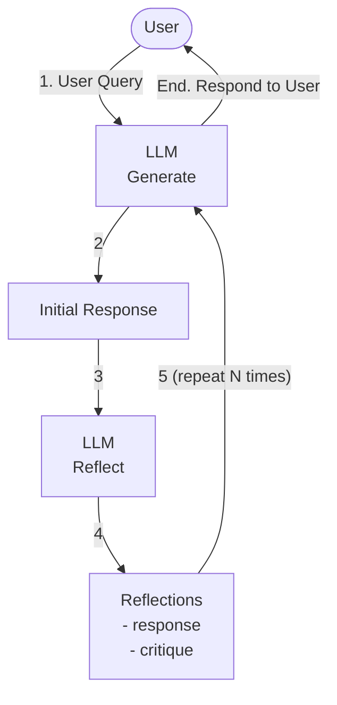
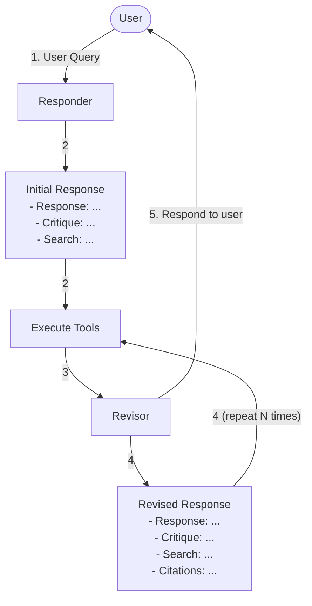

# Cheat Sheet: Build Self-Improving Agents with LangGraph

## Introduction

Modern agent architectures enable AI systems to critique and refine their own output for higher quality. These "self-improving" agents use loops where the agent reviews its work and acts on feedback. LangGraph—a graph-based framework for stateful LLM applications—makes it easy to implement these patterns.

At a high level, these can be categorized into three approaches: reflection agents, reflexion agents, and ReAct agents. Each uses a different strategy for self-improvement:

| Agent | Description |
|---|---|
| **Reflection agents** | Prompts the model to review its own answer (like a teacher grading its work). |
| **Reflexion agents** | Adds external feedback (search or tools) to guide corrections. |
| **ReAct agents** | Alternate reasoning and actions, thinking and doing in a loop (tool calls, chain-of-thought). |

LangGraph represents agents as graphs of states and nodes. The state (often a message history) flows through nodes (functions or LLM calls) linked by edges with conditional logic. Below, we explain each agent style, show sample LangGraph code, and give guidance on use cases.

## Reflection Agents

Reflection agents use internal critique to refine outputs. Conceptually, the agent first generates an initial answer, then a second step reflects on that answer. The reflector (often role-played as a teacher or critic) points out flaws or suggests improvements. The agent may loop this generate-then-reflect cycle a few times to polish the answer.

**Workflow of a reflection agent:**



| Concept | Description |
|---|---|
| **Mechanics** | Typically, one node calls the LLM to produce a response, and another node calls the LLM to critique or improve it. A simple LangGraph `MessageGraph` can model this two-step loop. |

**Example code**

Below, `generate_answer` and `critique_answer` are two nodes. We loop between them until a max step count is reached.

> **Note:** The code below is pseudocode for learning purposes — copy-pasting it as-is into an IDE won't run.

```python
from langgraph.graph import MessageGraph, END
from langchain_core.messages import HumanMessage, AIMessage


# Node that generates an initial response
def generate_answer(state):
    # (In practice, call an LLM here)
    answer = "This is my first attempt."
    return {"messages": state["messages"] + [AIMessage(content=answer)]}


# Node that critiques and refines the previous answer
def critique_answer(state):
    # (In practice, call LLM to critique)
    critique = "The answer is incomplete; add more detail."
    return {"messages": state["messages"] + [AIMessage(content=critique)]}


builder = MessageGraph()
builder.add_node("generate", generate_answer)
builder.add_node("reflect", critique_answer)
builder.set_entry_point("generate")


# Loop control: alternate until max iterations
MAX_STEPS = 3

def should_continue(state):
    return "reflect" if len(state["messages"]) < 2 * MAX_STEPS else END


builder.add_conditional_edges("generate", should_continue)
builder.add_edge("reflect", "generate")
graph = builder.compile()


# Run the reflection agent
initial_message = HumanMessage(content="Explain photosynthesis.")
result = graph.invoke({"messages": [initial_message]})
print(result["messages"][-1])  # Final answer or critique
```

This makes the agent self-critique its answer. In practice, the reflector node is prompted to evaluate the generator's output and return suggestions. The loop continues until no more revisions are needed or a limit is reached.

**When to use:** Reflection is useful for creative or open-ended tasks (e.g., drafting text, answering complex questions) where iterative refinement helps. It adds overhead (extra LLM calls) but often yields clearer, more thorough answers. However, since it only relies on the model's own reasoning (no outside data), the final answer may not improve much unless the reflector catches errors. Use Reflection when you want basic iterative self-improvement without adding external searches or tools.

## Reflexion Agents

Reflexion agents formalize the idea of reflection with external grounding. Here the agent not only critiques its output, but also uses external information or citations to do so. Each cycle typically involves three steps:

| Step | Description |
|---|---|
| **Draft (initial response)** | The agent generates an answer and may propose search queries (or tool calls) to gather facts. |
| **Execute tools** | These queries are run (for example, web search) and results are added to the context. |
| **Revise** | A "revisor" node has the agent analyze the draft answer plus fetched info, and explicitly list missing or incorrect parts. |

Reflexion forces the agent to cite sources and enumerate what's missing, making corrections more effective. In LangGraph, we chain three nodes in a loop (Draft → Execute Tools → Revise) until no further revisions are needed or a maximum iteration is reached.

**Workflow of a reflexion agent:**



| Concept | Description |
|---|---|
| **Mechanics** | Each iteration adds more grounding. For example, after the draft answer, the agent might search Wikipedia, then the revise step reads the search results and updates the answer. The revised answer goes back into the loop if needed. |

**Example code**

Below is pseudocode of a Reflexion-style loop (`execute_tools` is a stand-in for any external lookup).

```python
from langgraph.graph import MessageGraph, END
from langchain_core.messages import HumanMessage, AIMessage, SystemMessage


def draft_answer(state):
    # (LLM draft; could also generate search query)
    response = "The capital of France is Paris."
    return {"messages": state["messages"] + [AIMessage(content=response)]}


def execute_tools(state):
    # (Simulate external info; e.g., search results)
    info = "Paris (France) - capital: Paris (en.wikipedia.org)"
    return {"messages": state["messages"] + [SystemMessage(content=info)]}


def revise_answer(state):
    # (LLM re-evaluates answer using info)
    revision = "Yes, France's capital is Paris. I've verified this."
    return {"messages": state["messages"] + [AIMessage(content=revision)]}


builder = MessageGraph()
builder.add_node("draft", draft_answer)
builder.add_node("execute_tools", execute_tools)
builder.add_node("revise", revise_answer)
builder.add_edge("draft", "execute_tools")
builder.add_edge("execute_tools", "revise")


# Loop control: stop after N iterations
MAX_LOOPS = 2

def continue_reflexion(state):
    # Count assistant messages to determine iteration
    iteration = sum(1 for m in state["messages"] if isinstance(m, AIMessage))
    return "execute_tools" if iteration <= MAX_LOOPS else END


builder.add_conditional_edges("revise", continue_reflexion)
builder.set_entry_point("draft")
graph = builder.compile()

initial_message = HumanMessage(content="What is the capital of France?")
result = graph.invoke({"messages": [initial_message]})  # Final revised answer
```

This agent uses a built-in search or tool (`execute_tools`) to ground its critique. The revise node then updates the answer explicitly (e.g., adding evidence or fixing errors). The process stops when the agent judges the answer is good or after a set number of loops.

**When to use:** Reflexion is ideal when accuracy or factual grounding matters. Because it enforces evidence (citations) and points out missing info, it shines on fact-checking, research, or coding tasks where correctness is critical. It is more complex and slower (requires search/tool calls), but yields highly vetted answers. Use Reflexion agents for tasks like data lookup, code generation with static analysis, or any QA requiring references.

## ReAct Agents

ReAct (Reason + Act) agents interleave thinking and action. Rather than a separate "reflector" step, a ReAct agent alternates between internal reasoning (chain-of-thought) and taking actions (tool calls, function calls) in one workflow. Each cycle, the agent decides what to do, does it, then reasons again on the updated state.

**Workflow of a ReAct agent:**

| Concept | Description |
|---|---|
| **Mechanics** | The agent first uses the LLM to reason or plan (e.g., "I will search for the capital"). This might result in either a final answer or a tool request. If a tool call is needed, the agent calls it (e.g., a search API), adds the observation, and then thinks again with the new info. This continues until the agent outputs a final answer. The architecture is often: LLM node → Tool node → back to LLM, conditional on whether more tools are needed. |

**Example code**

Below is a simplified version for a weather agent (no actual API calls) showcasing ReAct (pseudocode). We define a `StateGraph` where the state includes a message history and logic flow:

```python
from langgraph.graph import StateGraph, END
from langchain_core.messages import HumanMessage, AIMessage


# Simple state with messages and a step counter
def call_model(state):
    # (LLM reasons; may request an action or give an answer)
    last = state["messages"][-1]
    if "weather" in last:
        # chain-of-thought leading to an action
        thought = AIMessage(content="Let me find the weather for you.")
        return {"messages": state["messages"] + [thought]}
    else:
        # final answer
        answer = AIMessage(content="It's sunny in NYC today.")
        return {"messages": state["messages"] + [answer]}


def call_tool(state):
    # (Simulate a weather API/tool result)
    tool_result = AIMessage(content="Weather(temperature=75F, condition=sunny)")
    return {"messages": state["messages"] + [tool_result]}


# Decide whether to act or finish based on last message
def next_step(state):
    last = state["messages"][-1]
    if "find the weather" in last:
        return "tools"
    return "end"


graph = StateGraph(dict)  # using a plain dict state
graph.add_node("think", call_model)
graph.add_node("act", call_tool)
graph.set_entry_point("think")

# If the model's message triggers an action, go to 'act'; else end.
graph.add_conditional_edges("think", next_step, {"tools": "act", "end": END})
graph.add_edge("act", "think")
compiled = graph.compile()

result = compiled.invoke({"messages": [HumanMessage(content="What is the weather in NYC?")]})
print(result["messages"][-1])  # Final assistant answer
```

Here the agent thinks (calls the model) and acts (calls a tool) alternately. The `next_step` function checks the content of the last assistant message to decide. In practice, a ReAct agent's prompt would instruct the model to output either an action or the final answer, and LangGraph routes accordingly.

**When to use:** ReAct is best for tasks that require tool use or complex planning, like interacting with APIs, databases, or multi-step reasoning. Because it weaves in actions dynamically, it can adapt to tasks (e.g., "Call calculator tool then interpret output"). It is simpler than Reflexion but more powerful than a basic chain-of-thought. Use ReAct agents when you need the model to reason and perform external actions in sequence. For quick setups, LangGraph even offers `create_react_agent` to instantiate a standard ReAct pattern with one call.

## Comparison of Agent Styles

| Aspect | Reflection agent | Reflexion agent | ReAct agent |
|---|---|---|---|
| **Core idea** | Model critiques its own answer | Model critiques with external feedback and citations | Model reasons and acts (calls tools) in a loop |
| **Structure** | Generator → Reflector → (loop) | Draft → (Search/Tool) → Revisor → (loop) | LLM → (conditional Tool call) → LLM → … |
| **Graph components** | 2 nodes (generate, reflect) | 3+ nodes (draft, execute tools, revise) | 2 nodes (think, act) with conditional branching |
| **Feedback source** | Internal (LLM self-review) | External (tool or search results + LLM review) | External (tool calls informed by model reasoning) |
| **Benefits** | Simple setup; improves coherence & detail | High accuracy; enforces evidence and completeness | Flexible tool use; handles complex tasks |
| **Drawbacks** | May plateau (no new info); extra compute | More complex and slow (searches/tools each loop) | Requires designing tools; complexity in prompts |
| **Use cases** | Refining essays, content drafts | Fact-checking, coding, QA with citations | Question answering with APIs, step-by-step tasks |

## Conclusion

Each architecture adds complexity (and cost in tokens/time) but also power. Reflection is simplest, ReAct adds structure, and Reflexion adds grounding. In practice, LangGraph makes it easy to experiment: you can even start with the built-in `create_react_agent` for a ReAct baseline, then customize as needed.

By understanding these patterns, you can build agents that evaluate and refine their own outputs. Whether through introspection or by leveraging tools and external data, self-improving agents aim for higher-quality, more reliable AI behavior.
