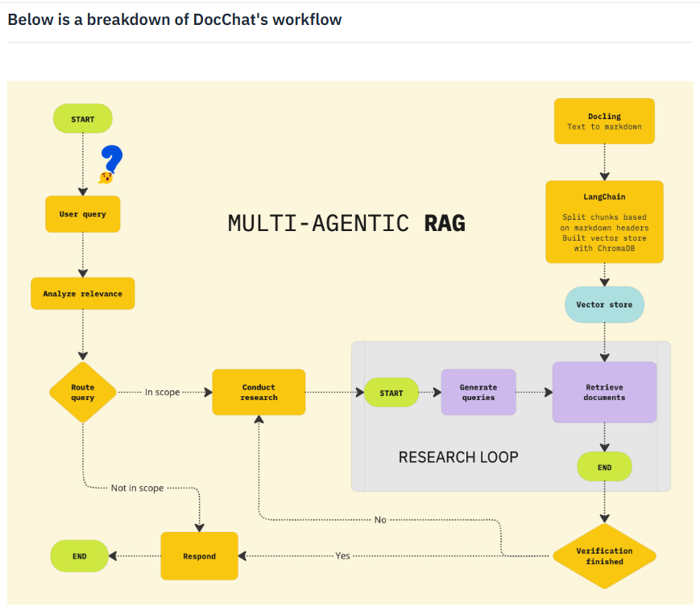
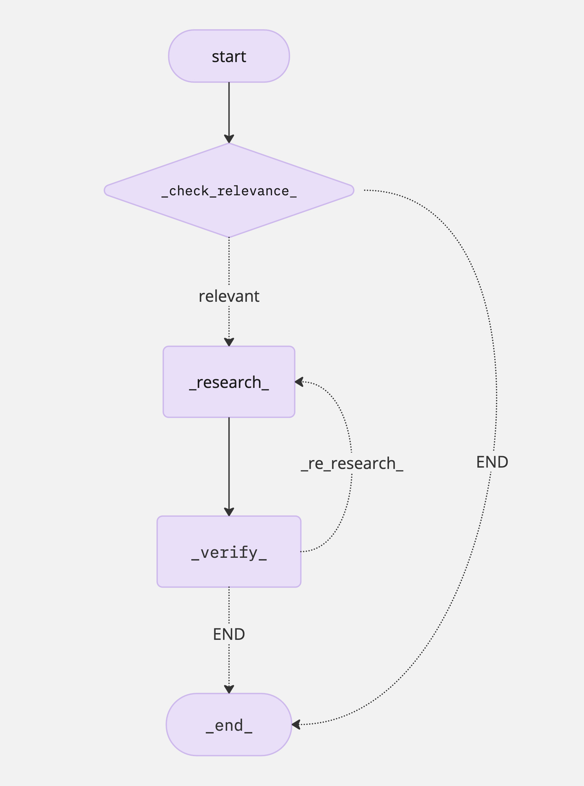

# DocChat: Multi-Agent RAG System

DocChat is a multi-agent RAG (Retrieval-Augmented Generation) tool that answers questions about long, structured documents (PDFs, Word files, text reports) with fact-checked, hallucination-resistant responses.

## Why multi-agent RAG is used

A naive RAG pipeline is often insufficient for handling long, structured documents due to several limitations:

- **Limited query understanding** — Naive RAG processes queries at a single level, failing to break down complex questions into multiple reasoning steps. This results in shallow or incomplete answers when dealing with multi-faceted queries.
- **No hallucination detection or error handling** — Traditional RAG pipelines lack a verification step. This means that if a response contains hallucinated or incorrect information, there's no mechanism to detect, correct, or refine the output.
- **Inability to handle out-of-scope queries** — Without a proper scope-checking mechanism, naive RAG may attempt to generate answers even when no relevant information exists, leading to misleading or fabricated responses.
- **Inefficient multi-document retrieval** — When multiple documents are uploaded, a naive RAG system might retrieve irrelevant or suboptimal passages, failing to select the most relevant content dynamically.

To overcome these challenges, DocChat implements a multi-agent RAG research system, which introduces intelligent agents to enhance retrieval, reasoning, and verification.

## How multi-agent RAG solves these issues

### Scope checking & routing
A Scope-Checking Agent first determines whether the user's question is relevant to the uploaded documents. If the query is out of scope, DocChat explicitly informs the user instead of generating hallucinated responses.

### Dynamic multi-step query processing
For complex queries, an Agent Workflow ensures that the question is broken into smaller sub-steps, retrieving the necessary information before synthesizing a complete response.

For example, if a question requires comparing two sections of a document, an agent-based approach recognizes this need, retrieves both parts separately, and constructs a comparative analysis in the final answer.

### Hybrid retrieval for multi-document contexts
When multiple documents are uploaded, the Hybrid Retriever (BM25 + Vector Search) ensures that the most relevant document(s) are selected dynamically, improving accuracy over traditional retrieval pipelines.

### Fact verification & self-correction
After an initial response is generated, a Verification Agent cross-checks the output against the retrieved documents.

If any contradictions or unsupported claims are found, the Self-Correction Mechanism refines the answer before presenting it to the user.

### Shared global state for context awareness
The Agent Workflow maintains a shared state, allowing each step (retrieval, reasoning, verification) to reference previous interactions and refine responses dynamically.

This enables context-aware follow-up questions, ensuring that users can refine their queries without losing track of previous answers.

## Workflow



### 1. User query processing & relevance analysis
The system starts when a user submits a question about their uploaded document(s).

Before retrieving any data, DocChat first analyzes query relevance to determine if the question is within the scope of the uploaded content.

### 2. Routing & query categorization
The query is routed through an intelligent agent that decides whether the system can answer it using the document(s):

- **In scope:** Proceed with document retrieval and response generation.
- **Not in scope:** Inform the user that the question cannot be answered based on the provided documents, preventing hallucinations.

### 3. Multi-agent research & document retrieval
If the query is relevant, DocChat retrieves relevant document sections from a hybrid search system:

- Docling converts the document into a structured Markdown format for better chunking.
- LangChain splits the document into logical chunks based on headers and stores them in ChromaDB (a vector store).
- The retrieval module searches for the most contextually relevant document chunks using BM25 and vector search.

### 4. Answer generation & verification loop
**Conduct research:**
- The research agent generates an initial answer based on retrieved content.
- A sub-process starts where queries are dynamically generated for more precise retrieval.

**Verification process:**
- The verification agent cross-checks the generated response against the retrieved content.
- If the response is fully supported, the system finalizes and returns the answer.
- If verification fails (e.g., hallucinations, unsupported claims), the system re-runs the research step until a verifiable response is found.

### 5. Response finalization
After verification is complete, DocChat returns the final response to the user.

The workflow ensures that each answer is sourced directly from the provided document(s), preventing fabrication or unreliable outputs.

## Build vector database

### 1. Document parsing with Docling
Processing PDFs with complex structures, tables, and intricate layouts requires careful selection of a reliable document parsing tool. Many libraries struggle with accuracy when dealing with nested tables, multi-column formats, or scanned PDFs, often resulting in misaligned text, missing data, or broken layouts.

To overcome these challenges, DocChat leverages Docling—an open-source document processing library designed for high-precision parsing and structured data extraction.

**Why Docling?**
- **Accurate table & layout parsing:** Recognizes complex table structures, reading sequences, and multi-column layouts.
- **Multi-format support:** Reads and exports documents in Markdown, JSON, PDF, DOCX, PPTX, XLSX, HTML, AsciiDoc, and images.
- **OCR for scanned PDFs:** Extracts text from scanned documents using optical character recognition (OCR).
- **Seamless integration with LangChain:** Enables structured chunking for better retrieval and vector search in ChromaDB.

To showcase Docling's superiority over LangChain in handling complex PDFs, we compare both tools on two types of scanned PDF documents: one saved as an image file and another saved as a standard PDF.

**The Docling approach**
- Uses `DocumentConverter` to extract structured content.
- Converts the PDF into Markdown format.
- Splits the extracted content based on headers using `MarkdownHeaderTextSplitter`.
- Prints the full extracted sections for review.

**LangChain approach**
- Uses `PyPDFLoader` to load the document.
- Extracts raw text from each PDF page.
- Prints the entire extracted text.

PyPDFLoader is designed for digitally generated PDFs that contain embedded text, rather than scanned documents where the text is essentially an image. Since LangChain does not have built-in OCR (Optical Character Recognition) capabilities, it cannot process PDFs that contain scanned images of text, making it ineffective for handling historical documents, academic papers, or other non-digitally generated content.

On the other hand, Docling is equipped to handle both structured and unstructured PDFs, including scanned documents, making it a far more versatile and reliable tool for text extraction in complex scenarios. This demonstrates Docling's advantage in working with real-world PDFs, where many documents are scanned rather than digitally created.

### 2. Building a vector database with ChromaDB
Once documents have been parsed and structured using Docling, the next step is to efficiently store and retrieve relevant document chunks. This is where ChromaDB comes into play—a high-performance vector database optimized for fast and accurate similarity search.

**What is Chroma DB?**
Chroma DB is an open-source vector database optimized for fast and scalable similarity search. It enables efficient storage, retrieval, and ranking of document embeddings, making it a key component of RAG workflows.

**Why ChromaDB?**
- **Blazing-fast vector search:** Finds the most relevant document chunks in milliseconds.
- **Persistent storage:** Keeps embeddings saved for reuse across sessions.
- **Seamless LangChain integration:** Works natively with LangChain for retrieval-augmented generation (RAG).
- **Scalable and lightweight:** Handles millions of embeddings efficiently without complex infrastructure.

## The `DocumentProcessor` class

The `DocumentProcessor` class (`document_processor/file_handler.py`) is responsible for handling document parsing, caching, and chunking. It ensures efficient processing by:

- Validating file sizes before processing.
- Using caching to avoid redundant processing of previously uploaded files.
- Extracting structured content from documents using Docling.
- Splitting text into chunks using `MarkdownHeaderTextSplitter` for better retrieval in vector databases.

### Function breakdown

**`__init__(self)`**
Initializes the document processor with:
- A predefined header structure for Markdown-based chunking.
- A cache directory for storing processed document chunks.
- Ensures that the cache directory exists.

**`validate_files(self, files: List) -> None`**
Purpose: Ensures that the total size of uploaded files does not exceed a predefined limit.

How it works:
- Computes the total size of all uploaded files.
- Compares the total size against `constants.MAX_TOTAL_SIZE`.
- Raises a `ValueError` if the limit is exceeded.

**`process(self, files: List) -> List`**
Purpose: Handles the entire document processing pipeline, including caching and deduplication.

How it works:
- Validates the uploaded files.
- Generates a hash of each file's content to check if it has been processed before.
- If cached, loads the data from cache.
- If not cached, processes the file using `_process_file()` and stores the results in cache.
- Ensures that no duplicate chunks are stored across multiple files.

**`_process_file(self, file) -> List`**
Purpose: Converts the document into Markdown and splits it into structured text chunks.

How it works:
- Skips unsupported file types (only processes `.pdf`, `.docx`, `.txt`, and `.md`).
- Uses Docling's `DocumentConverter` to convert the file to Markdown.
- Splits the extracted Markdown text using `MarkdownHeaderTextSplitter`.

**`_generate_hash(self, content: bytes) -> str`**
Purpose: Generates a unique SHA-256 hash from document content.

Use case: Helps in detecting duplicate files and chunks.

**`_save_to_cache(self, chunks: List, cache_path: Path)`**
Purpose: Saves the processed document chunks in a pickle file for future use.

How it works:
- Stores the chunks along with a timestamp for expiration checking.

**`_load_from_cache(self, cache_path: Path) -> List`**
Purpose: Loads cached document chunks from a previously processed file.

How it works:
- Opens the cached pickle file and extracts stored document chunks.

**`_is_cache_valid(self, cache_path: Path) -> bool`**
Purpose: Checks if the cached file is still valid (not expired).

How it works:
- Compares the modification timestamp of the cached file against the `CACHE_EXPIRE_DAYS` setting.
- If the file is older than the expiration threshold, it is considered invalid.

### Quick function recap

| Function | Purpose |
|---|---|
| `__init__()` | Initializes cache directory and header settings. |
| `validate_files(files: List)` | Ensures that uploaded files do not exceed the size limit. |
| `process(files: List) -> List` | Handles document processing, caching, and deduplication. |
| `_process_file(file) -> List` | Converts a document into Markdown and splits it into chunks. |
| `_generate_hash(content: bytes) -> str` | Creates a unique hash of file content. |
| `_save_to_cache(chunks: List, cache_path: Path)` | Saves processed document chunks to cache. |
| `_load_from_cache(cache_path: Path) -> List` | Loads cached document chunks if available. |
| `_is_cache_valid(cache_path: Path) -> bool` | Checks if a cached file is still valid. |

### Summary

The `DocumentProcessor` class ensures efficient document parsing and retrieval by leveraging:
- Docling for structured content extraction.
- ChromaDB-compatible chunking for vector search.
- A caching system to avoid redundant processing.

By using this approach, DocChat can efficiently retrieve relevant document chunks, making AI-powered retrieval-augmented generation (RAG) more scalable.

## LangGraph multi-agent system structure

### Understanding LangGraph: a multi-agent orchestration framework

#### 1. What is agentic AI?
Agentic AI describes a system or program that can independently execute tasks for a user or another system. It autonomously designs workflows, utilizes available tools, makes decisions, takes actions, solves complex problems, and interacts with external environments, extending its capabilities beyond the data used to train its machine learning (ML) models.

#### 2. What is a multi-agent system (MAS)?
A multi-agent system (MAS) is composed of multiple artificial intelligence (AI) agents collaborating to carry out tasks for a user or another system.

#### 3. Key relationship between agentic AI and MAS

| Characteristic | Agentic AI | Multi-agent systems (MAS) |
|---|---|---|
| Autonomy | Central focus—autonomous task execution | May include agents with varying levels of autonomy |
| Interaction | Limited to tools, systems, or environments | Key focus—agents interact, communicate, and coordinate |
| Scope | Individual agent | Multiple agents in a shared system |
| Dependency | Agentic AI can exist independently | MAS may involve agentic AI but doesn't require it |

#### 4. What is LangGraph?
LangGraph is an open-source Python framework designed for multi-agent workflows in AI applications. It extends LangChain by enabling graph-based state management, making it easier to coordinate multiple AI agents in structured workflows.

LangGraph is particularly useful in RAG and multi-step reasoning, where multiple agents collaborate to refine, verify, and improve responses dynamically.

**Key features of LangGraph**
- **Graph-based execution:** Workflows are defined as state machines, allowing structured decision-making.
- **Multi-agent coordination:** Easily integrates multiple agents, each responsible for a specific task.
- **Dynamic state management:** Maintains memory and enables iterative refinement of AI-generated responses.
- **Supports loops & conditionals:** Workflows can adapt based on real-time decisions.

#### 5. How does LangGraph work?
LangGraph operates on the principle of stateful workflows, where each step in the process is defined as a node in a directed graph. The edges define transitions between nodes based on logic.

A LangGraph workflow consists of:
- **Nodes:** They represent individual processing steps (for example, research, verification).
- **Edges:** They define the flow of execution (for example, go to verification after research).
- **State objects:** They store data passed between agents.
- **Conditional transitions:** Allow decision-making between nodes.

#### 6. Graph structure for this project
The `AgentWorkflow` class constructs the multi-agent system using LangGraph's `StateGraph`, ensuring a structured approach to information retrieval and verification.



**Workflow breakdown**
1. **Check relevance** – The `RelevanceChecker` determines if the query can be answered based on the retrieved documents.
   - If relevant → Proceed to research.
   - If irrelevant → Terminate workflow.
2. **Research step** – The `ResearchAgent` generates a draft answer using relevant documents.
3. **Verification step** – The `VerificationAgent` assesses the draft answer for accuracy and relevance.
4. **Decision making** – Based on verification:
   - If the answer lacks support → Re-research and refine.
   - If verified → End workflow.

## Relevance checker: ensuring query-document alignment

The `RelevanceChecker` (`agents/relevance_checker.py`) is responsible for determining whether retrieved documents contain relevant information to answer a given question. It uses an ensemble retriever to fetch document chunks and then leverages OpenAI for classification. The goal is to categorize relevance into three possible labels:

- **`CAN_ANSWER`** – The documents provide sufficient information for a full answer.
- **`PARTIAL`** – The documents mention the topic but lack complete details.
- **`NO_MATCH`** – The documents do not discuss the question at all.

This classification helps filter out irrelevant queries, ensuring that further processing is only performed on useful data.

### How it works

**1. Retrieving relevant documents**

The `check()` method first retrieves document chunks from an ensemble retriever:

```python
top_docs = retriever.invoke(question)
if not top_docs:
    return "NO_MATCH"
```

If no documents are retrieved, it immediately classifies the query as `"NO_MATCH"`.

**2. Constructing the LLM prompt**

If relevant documents are found, the system concatenates the top-k document chunks into a single string:

```python
document_content = "\n\n".join(doc.page_content for doc in top_docs[:k])
```

Then, it generates a prompt for the OpenAI model:

```python
prompt = f"""
You are an AI relevance checker between a user's question and provided document content.

**Instructions:**
- Classify how well the document content addresses the user's question.
- Respond with only one of the following labels: CAN_ANSWER, PARTIAL, NO_MATCH.
...
**Question:** {question}
**Passages:** {document_content}
...
"""
```

The prompt clearly instructs the AI model to strictly return one of the three labels.

The AI considers both explicit answers and partial mentions before making a decision.

**3. Running the classification model**

The OpenAI Chat Completions API is used to query the model:

```python
response = self.client.chat.completions.create(
    model=MODEL_ID,
    messages=[
        {
            "role": "user",
            "content": prompt
        }
    ],
    temperature=0,
    max_tokens=10,
)
```

The LLM processes the question and passages to determine relevance.

If an error occurs (e.g., API failure), the function defaults to `"NO_MATCH"` to prevent crashes.

**4. Extracting and validating the LLM response**

Once the AI returns a classification:

```python
llm_response = response.choices[0].message.content.strip().upper()
```

The function ensures that the response is one of the three valid labels:

```python
valid_labels = {"CAN_ANSWER", "PARTIAL", "NO_MATCH"}
if llm_response not in valid_labels:
    classification = "NO_MATCH"
else:
    classification = llm_response
```

If the model returns unexpected text, the function forces `"NO_MATCH"` to maintain consistency.

## Research agent: generating initial responses using document context

The `ResearchAgent` (`agents/research_agent.py`) is responsible for generating an initial draft answer using retrieved documents. It interacts with OpenAI to synthesize responses based on relevant content. This step is crucial in the RAG pipeline, ensuring that AI-generated answers are grounded in the provided data.

### Key functions of the research agent
- **Context-aware answer generation:** Produces fact-based responses using retrieved documents.
- **Structured prompting:** Ensures that the AI model adheres to precise instructions for accurate outputs.
- **Response sanitization:** Cleans and formats LLM responses for better readability.

### How it works

**1. Initializing the model**

The `ResearchAgent` is initialized with the OpenAI client, using `gpt-4o-mini`:

```python
MODEL_ID = "gpt-4o-mini"
MAX_TOKENS = 300
TEMPERATURE = 0.3  # Controls randomness; lower values make output more deterministic

self.client = OpenAI(api_key=settings.OPENAI_API_KEY)
```

The `temperature` parameter controls the model's creativity.

`max_tokens` defines how long the generated response can be.

**2. Constructing a prompt for the LLM**

The agent generates a structured prompt to ensure fact-based and context-aware responses:

```python
def generate_prompt(self, question: str, context: str) -> str:
    prompt = f"""
    You are an AI assistant designed to provide precise and factual answers based on the given context.

    **Instructions:**
    - Answer the following question using only the provided context.
    - Be clear, concise, and factual.
    - Return as much information as you can get from the context.
    
    **Question:** {question}
    **Context:**
    {context}

    **Provide your answer below:**
    """
    return prompt
```

The AI must rely solely on the retrieved documents (no hallucinations).

It is explicitly instructed to return as much information as possible while staying factual.

**3. Generating a response**

The agent aggregates relevant document content before sending it to the AI:

```python
context = "\n\n".join([doc.page_content for doc in documents])
prompt = self.generate_prompt(question, context)
```

- Combines multiple document excerpts into a single context block.
- Prepares a query tailored for the OpenAI model.

The LLM is then queried via the Chat Completions API:

```python
response = self.client.chat.completions.create(
    model=MODEL_ID,
    messages=[
        {
            "role": "user",
            "content": prompt
        }
    ],
    max_tokens=MAX_TOKENS,
    temperature=TEMPERATURE,
)
```

The AI model processes the question + context to generate an informed response.

**4. Extracting and cleaning the LLM response**

The raw response from the LLM is extracted:

```python
llm_response = response.choices[0].message.content.strip()
```

If the response is unexpected or malformed, the function returns a fallback message:

```python
if not llm_response:
    draft_answer = "I cannot answer this question based on the provided documents."
```

Finally, the response is sanitized for readability:

```python
def sanitize_response(self, response_text: str) -> str:
    return response_text.strip()
```

The final output includes both:
- The generated draft answer
- The context used for generation

```python
return {
    "draft_answer": draft_answer,
    "context_used": context
}
```

## Verification agent: ensuring answer accuracy and relevance

The `VerificationAgent` (`agents/verification_agent.py`) is responsible for fact-checking and validating generated answers using the retrieved documents. This agent ensures that the AI-generated response is:

- Supported by factual evidence from the documents.
- Free from contradictions or misinformation.
- Relevant to the original question.

It interacts with OpenAI to analyze the relationship between the answer and its source documents, producing a structured verification report.

## Hybrid retriever: combining BM25 and vector search for optimal document retrieval

The `RetrieverBuilder` class (`retriever/builder.py`) implements a hybrid retrieval system by combining:

- **BM25 (Lexical Search):** Traditional keyword-based retrieval.
- **Vector Search (Embedding-based):** Semantic retrieval using embeddings.

This combination enhances the accuracy of RAG by leveraging the strengths of both approaches.

### Why use a hybrid retriever?
- **Improves recall:** Captures both exact keyword matches and semantically similar content.
- **Balances precision & relevance:** BM25 retrieves highly precise keyword matches, while vector retrieval finds related concepts.
- **Handles misspellings & variations:** Vector embeddings allow for fuzzy matching beyond exact keyword searches.
- **Optimized for multi-agent systems:** Ensures robust document retrieval before passing data to AI agents.

### Why is this essential for RAG?
- Ensures high-quality document retrieval for multi-agent research workflows.
- Improves AI response accuracy by providing both keyword-based and semantic matches.
- Enhances retrieval diversity, ensuring that no relevant document is overlooked.

With hybrid retrieval, the system achieves a balance between precision and recall, ensuring that AI-generated responses are grounded in the most relevant information.

### How the hybrid retriever works

**1. Initializing OpenAI embeddings**

The retriever initializes OpenAI embeddings to enable semantic vector retrieval:

```python
self.embeddings = OpenAIEmbeddings(
    model="text-embedding-3-small",
    api_key=settings.OPENAI_API_KEY
)
```

OpenAI converts documents into dense vector embeddings.

These embeddings are later used for semantic similarity search.

**2. Building the hybrid retriever**

The `build_hybrid_retriever()` method constructs a dual-mode retriever using BM25 and vector-based retrieval.

**Step 1: Creating a vector store with ChromaDB**

```python
vector_store = Chroma.from_documents(
    documents=docs,
    embedding=self.embeddings,
    persist_directory=settings.CHROMA_DB_PATH
)
```

- Stores document embeddings using ChromaDB.
- Enables fast vector-based similarity search.

**Step 2: Initializing BM25 retriever**

```python
bm25 = BM25Retriever.from_documents(docs)
```

- Uses term frequency-inverse document frequency (TF-IDF) scoring.
- Ranks documents based on keyword relevance.

**Step 3: Creating the vector retriever**

```python
vector_retriever = vector_store.as_retriever(search_kwargs={"k": settings.VECTOR_SEARCH_K})
```

- Retrieves documents based on vector similarity.
- Returns top-k most relevant results.

**Step 4: Combining both retrievers**

```python
hybrid_retriever = EnsembleRetriever(
    retrievers=[bm25, vector_retriever],
    weights=settings.HYBRID_RETRIEVER_WEIGHTS
)
```

- Merges BM25 and vector retrieval results into a single ranked list.
- Uses `HYBRID_RETRIEVER_WEIGHTS` to adjust the importance of lexical vs. vector search.

## Defining the main logic of the application

`app.py` defines the main logic of the application, integrating all the components of the multi-agent system (MAS). It connects the DocChat backend to a user-friendly Gradio interface, letting users upload document(s) and have a Q&A session about them.

### Why use Gradio?
Gradio is a powerful Python library for building web-based interfaces for machine learning and AI models. While we provide a simple Gradio-based interface to start with, customizing the interface further is beyond the scope of this project. You are welcome to explore more advanced Gradio features to enhance the user experience.

### DocChat application: bringing RAG-based question answering to life
The `app.py` script serves as the main entry point for DocChat, a multi-agent RAG (retrieval-augmented generation) system powered by Gradio, LangGraph, and OpenAI. It provides a user-friendly interface for uploading documents, submitting queries, and retrieving AI-generated answers along with verification reports.

### How the application works
The app follows a structured workflow:
1. Users upload documents or select a predefined example.
2. The hybrid retriever extracts relevant document chunks.
3. The multi-agent system (LangGraph) processes the query.
4. The AI generates an answer & a verification report.
5. The response is displayed in the Gradio interface.

### Key components in `app.py`

**1. Predefined example data**

The application provides example questions and documents for demonstration:

```python
EXAMPLES = {
    "Google 2024 Environmental Report": {
        "question": "Retrieve the data center PUE efficiency values in Singapore...",
        "file_paths": ["examples/google-2024-environmental-report.pdf"]  
    },
    "DeepSeek-R1 Technical Report": {
        "question": "Summarize DeepSeek-R1 model's performance...",
        "file_paths": ["examples/DeepSeek Technical Report.pdf"]
    }
}
```

Users can load these examples instead of manually uploading documents.

**2. Initializing core components**

The script initializes the three core components responsible for document processing, retrieval, and query handling:

```python
processor = DocumentProcessor()
retriever_builder = RetrieverBuilder()
workflow = AgentWorkflow()
```

- `DocumentProcessor`: Extracts structured content from uploaded files.
- `RetrieverBuilder`: Constructs a hybrid retrieval system (BM25 + Vector Search).
- `AgentWorkflow`: Orchestrates the multi-agent processing pipeline using LangGraph.

**3. Creating the Gradio interface**

The app is built using Gradio Blocks, which provides a clean, interactive UI:

```python
with gr.Blocks(theme=gr.themes.Citrus(), title="DocChat 🐥", css=css, js=js) as demo:
    gr.Markdown("## DocChat: powered by Docling 🐥 and LangGraph", elem_classes="subtitle")
    gr.Markdown("📤 Upload your document(s), enter your query then press Submit 📝", elem_classes="text")
```

- Uses Markdown descriptions to guide users.
- Implements custom CSS & JavaScript for enhanced styling.

**UI elements**

| Component | Purpose |
|---|---|
| `gr.Files()` | Allows users to upload documents |
| `gr.Textbox()` | Accepts user queries |
| `gr.Button("Submit 🚀")` | Processes the request and retrieves results |
| `gr.Dropdown()` | Lets users select predefined example questions |
| `gr.Button("Load Example 🛠️")` | Loads the selected example into the UI |
| `gr.Textbox(interactive=False)` | Displays the AI-generated answer and verification report |
| `gr.Markdown()` | Provides instructions and UI labels |

**4. Managing document caching & retrieval**

To avoid reprocessing unchanged documents, the app maintains a session state:

```python
session_state = gr.State({
    "file_hashes": frozenset(),
    "retriever": None
})
```

When users submit a query, the system checks if the uploaded documents have changed:

```python
current_hashes = _get_file_hashes(uploaded_files)

if state["retriever"] is None or current_hashes != state["file_hashes"]:
    logger.info("Processing new/changed documents...")
    chunks = processor.process(uploaded_files)
    retriever = retriever_builder.build_hybrid_retriever(chunks)

    state.update({
        "file_hashes": current_hashes,
        "retriever": retriever
    })
```

- If documents have not changed, the existing retriever will be reused.
- If documents have changed, the system reprocesses them and updates the retriever.

**5. Processing queries with the multi-agent workflow**

Once the retriever is ready, the LangGraph-based agent system processes the query:

```python
result = workflow.full_pipeline(
    question=question_text,
    retriever=state["retriever"]
)
```

- The relevance checker determines if the question can be answered.
- The research agent generates a response using retrieved documents.
- The verification agent validates the response and flags inconsistencies.

Finally, the AI-generated answer and verification report are displayed in the UI.

**6. File hashing for efficient processing**

To prevent redundant processing, file contents are hashed using SHA-256:

```python
def _get_file_hashes(uploaded_files: List) -> frozenset:
    """Generate SHA-256 hashes for uploaded files."""
    hashes = set()
    for file in uploaded_files:
        with open(file.name, "rb") as f:
            hashes.add(hashlib.sha256(f.read()).hexdigest())
    return frozenset(hashes)
```

This ensures that the same document is not processed multiple times unnecessarily.

**7. Launching the application**

The Gradio app is deployed locally:

```python
demo.launch(server_name="127.0.0.1", server_port=5000, share=True)
```

- Runs on localhost (`127.0.0.1`) at port `5000`.
- The `share=True` flag allows external users to test the application.
