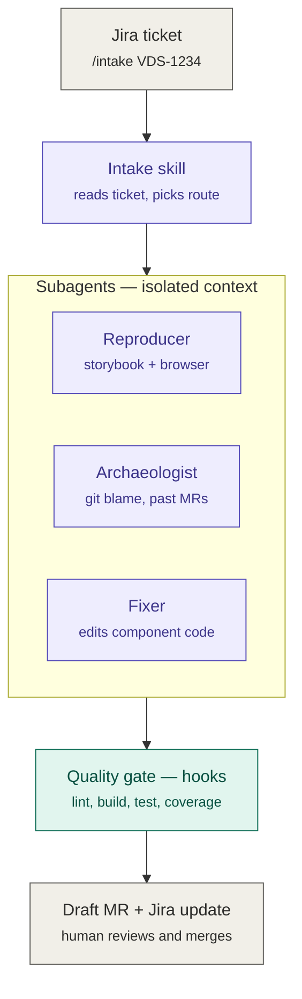
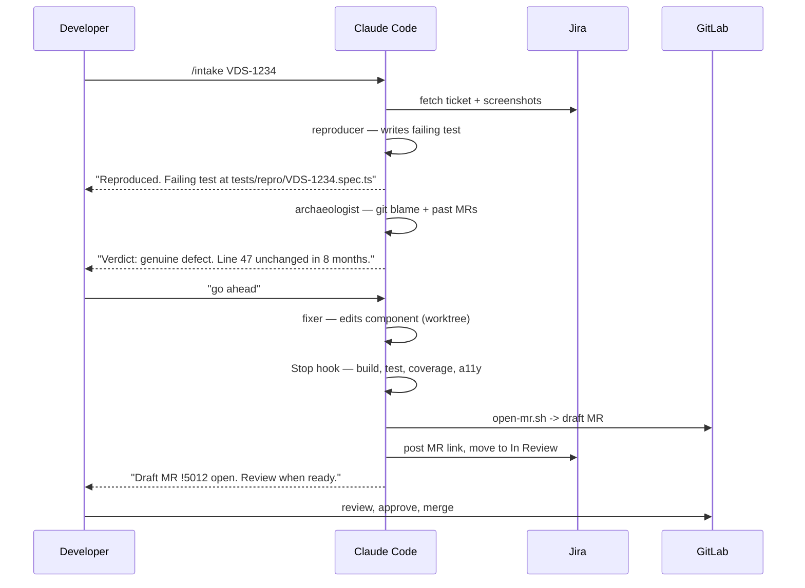

# VDS Code Automation Agent — Implementation Plan

**Owner:** Shadab (VDS / Monarch)
**Runtime:** Claude Code (terminal + VS Code), packaged as a team plugin
**Scope:** Two automated workflows — `/intake` (bug fix) and `/feature` (new component or component change)

---

## 1. What we are building, in one paragraph

A pair of repeatable workflows that take a Jira ticket and produce a **draft merge request** against `development`, with a reproduction test, a fix, and a written rationale attached. A human reviews and merges. Nothing auto-merges, ever.

The design principle behind every decision below:

> **Anything a script can do reliably is a script the agent calls. It is never something the agent improvises.**

Build, test, coverage, branch naming, MR creation, token validation — deterministic. The model is reserved for the four things a script genuinely cannot do:

1. Read and interpret the ticket (including screenshots)
2. Reproduce the defect
3. Judge whether the reported bug is *valid*
4. Write a fix that looks like the rest of VDS

---

## 2. Architecture at a glance



**Purple = Claude reasons. Teal = a script decides.** The boundary between those two colours is the most important line in the system. Every time a run goes wrong, the fix is almost always "move that step across the line into teal."

---

## 3. The building blocks, in plain terms

| Piece | Think of it as | What goes in it |
|---|---|---|
| `CLAUDE.md` | House rules pinned to the wall | Build commands, repo layout, "never touch `dist/`". Keep under ~200 lines |
| `.claude/rules/` | Rules that only apply in certain rooms | Path-scoped guidance — token rules load only when `*.tokens.json` is opened |
| Skill | A playbook in a drawer, invoked as `/name` | `/intake`, `/feature`, plus reference material like the VDS API style guide |
| Subagent | A colleague with their own desk | Reproducer, archaeologist, fixer. Their work stays out of your main context; you get a summary |
| MCP server | Hands that reach outside the repo | Jira, GitLab, Figma bridge, browser |
| Hook | A tripwire | Fires automatically on lifecycle events — lint after edit, block a push to `development` |
| Plugin | A zip file for all of the above | How this ships to the rest of the VDS team |

Two current facts worth noting, because they changed recently:

- **Skills and slash commands are the same thing now.** A skill is invoked as `/name`, or Claude loads it automatically when its description matches the task.
- **Hooks can run more than shell commands.** A hook can fire a shell command, an HTTP request, an MCP tool call, an LLM prompt, or an entire subagent.

> Config key names and frontmatter fields move faster than most docs. Verify against <https://code.claude.com/docs/en/features-overview> before you commit the first version.

---

## 4. Target repo layout

```
vds/
├── CLAUDE.md                         # always-on house rules (<200 lines)
├── .claude/
│   ├── settings.json                 # hooks + permissions (checked in, team-wide)
│   ├── rules/
│   │   ├── tokens.md                 # paths: src/**/*.tokens.json
│   │   ├── components.md             # paths: src/components/**
│   │   └── stories.md                # paths: **/*.stories.tsx
│   ├── skills/
│   │   ├── intake/SKILL.md           # /intake — bug fix workflow
│   │   ├── feature/SKILL.md          # /feature — new feature workflow
│   │   └── vds-conventions/SKILL.md  # reference: API + naming style guide
│   └── agents/
│       ├── reproducer.md
│       ├── archaeologist.md
│       └── fixer.md
├── scripts/agent/                    # the deterministic half of the system
│   ├── resolve-story.mjs             # component name -> storybook story id
│   ├── quality-gate.sh               # lint + build + test + coverage + a11y
│   ├── validate-tokens.mjs           # reject hardcoded hex / px values
│   ├── guard-branch.sh               # PreToolUse: block push to protected branches
│   └── open-mr.sh                    # branch + commit + push + draft MR
└── .mcp.json                         # project-scoped MCP servers
```

Everything in `scripts/agent/` must be runnable by a human with no agent involved. If you cannot run it yourself from a terminal, the agent cannot rely on it either.

---

## 5. Phase 0 — Prerequisites (half a day)

**Goal:** prove every external system is reachable before writing a single skill.

| Check | How to verify |
|---|---|
| Claude Code installed and authenticated | `claude` launches in the VDS repo |
| Jira MCP connected, read + comment scopes | Ask Claude: "fetch VDS-1234 and list its attachments" |
| GitLab MCP connected, can create draft MRs | Ask Claude: "list open MRs against development" |
| Figma bridge MCP reachable | Call `analyze_design` on a known frame |
| Storybook builds to a static bundle | `npm run build-storybook` produces `storybook-static/index.json` |
| Browser automation available | Playwright installed, or a browser MCP connected |

**Exit criteria:** you can run `/mcp` and see every server green. Do not proceed until this is true — every later phase assumes these connections work.

---

## 6. Phase 1 — Foundation: rules and context (1 day)

### 6.1 `CLAUDE.md`

This is loaded into every single session, so it is expensive. Only put things here that are true *always*.

```markdown
# VDS — Verizon Design System

## Commands
- Install: `npm ci`
- Dev storybook: `npm run storybook`
- Static storybook: `npm run build-storybook`
- Build: `npm run build`
- Test: `npm test`
- Full quality gate: `./scripts/agent/quality-gate.sh`

## Structure
- Components live in `src/components/<ComponentName>/`
- Each component folder: index.ts, <Name>.tsx, <Name>.test.tsx,
  <Name>.stories.tsx, <Name>.types.ts
- Tokens are generated. Never hand-edit anything under `dist/` or `build/`.

## Non-negotiables
- Never commit directly to `development` or `main`
- Never use `git commit --no-verify` or `git push --force`
- Never introduce a raw colour or spacing value — use a DTCG token path
- The reference implementation for conventions is `src/components/Chip`
```

### 6.2 Path-scoped rules

Keeps `CLAUDE.md` small. A rule with a `paths` frontmatter only loads when Claude opens a matching file.

```markdown
---
paths: ["src/**/*.tokens.json", "src/tokens/**"]
---
- Token names follow DTCG dot-paths, e.g. `color.background.brand.primary`
- Every new token needs a matching Figma variable key in the alias graph
- Never add a token without adding it to `catalog.json`
```

### 6.3 `.mcp.json`

Project-scoped so the whole team inherits the same servers:

```json
{
  "mcpServers": {
    "jira":   { "type": "http", "url": "https://<internal>/jira-mcp" },
    "gitlab": { "type": "http", "url": "https://<internal>/gitlab-mcp" },
    "figma-bridge": { "type": "http", "url": "https://<internal>/figma-bridge-mcp" }
  }
}
```

**Exit criteria:** open a fresh session, ask Claude "where do Chip's stories live and how do I run the tests?" — it answers without searching the filesystem.

---

## 7. Phase 2 — The reproduction harness (2 days)

This is the phase people skip, and it is the one that makes everything else work.

### 7.1 Deterministic story lookup

Do not let the agent hunt for the right Storybook story. Build the static bundle once and resolve by lookup:

```js
// scripts/agent/resolve-story.mjs
// usage: node resolve-story.mjs Chip --variant=disabled
// prints: http://localhost:6006/iframe.html?id=components-chip--disabled
```

It reads `storybook-static/index.json`, matches the component name, and prints the iframe URL. That turns "find the component" from a search problem into a one-line lookup.

### 7.2 The repro-first rule

> **The reproducer's deliverable is a failing test, not a screenshot.**

Before any source file is touched, the reproducer must write a Playwright or Storybook interaction test that **fails on current `development`**. Three things fall out of this for free:

1. You get the regression test with every fix, automatically
2. "Did we fix it?" becomes a boolean instead of a judgment call
3. An un-reproducible bug is caught *before* code is written, not after

### 7.3 The stopping rule

If the reproducer cannot produce a failing test within its turn budget, the run **stops**. It posts what it learned to Jira and hands back to a human. An agent that grinds indefinitely is worse than one that gives up clearly.

### 7.4 Version-mismatch branch

If the bug does not reproduce on `development` but the ticket cites an older library version, the run stops and drafts an "upgrade and retest" Jira comment for your approval. No code is touched.

**Exit criteria:** run the reproducer by hand against three known past bugs. It should produce a failing test for all three.

---

## 8. Phase 3 — Hooks: the enforcement layer (1 day)

An instruction in `CLAUDE.md` is a *request*. A hook is *enforcement*. Anything that must hold every single time belongs here.

```json
{
  "hooks": {
    "PostToolUse": [
      {
        "matcher": "Edit|Write",
        "hooks": [
          { "type": "command", "command": "./scripts/agent/lint-changed.sh" },
          { "type": "command", "command": "node ./scripts/agent/validate-tokens.mjs" }
        ]
      }
    ],
    "PreToolUse": [
      {
        "matcher": "Bash",
        "hooks": [
          { "type": "command", "command": "./scripts/agent/guard-branch.sh" }
        ]
      }
    ],
    "Stop": [
      {
        "hooks": [
          { "type": "command", "command": "./scripts/agent/quality-gate.sh" }
        ]
      }
    ]
  }
}
```

| Hook | Fires when | What it enforces |
|---|---|---|
| `PostToolUse` on edit | After every file write | prettier, eslint, `tsc` on the touched file only — fast feedback |
| `PostToolUse` token check | After every file write | Rejects hardcoded hex or px values that map to no DTCG path |
| `PreToolUse` on Bash | Before any shell command | Blocks `git push` to `development`/`main`, `--no-verify`, `--force` |
| `Stop` | Before the agent can finish | Full build, test, coverage threshold, jscpd, bundle size, axe-core, visual regression |

Two notes:

- **Hooks merge, they do not override.** Ship the team gate in the plugin; individuals can add their own on top without conflict.
- **Hook output lands in context.** A failing lint hook feeds its output back as text the agent reads and reacts to. That is the point — it self-corrects without you intervening.

**Exit criteria:** deliberately ask Claude to push to `development`. It must be blocked by the script, not by politeness.

---

## 9. Phase 4 — Subagents (2 days)

Split work out of the main session once a step starts flooding your context with output you will never read again.

### 9.1 Reproducer

```markdown
---
name: reproducer
description: Reproduces a reported VDS defect in Storybook and writes a failing test.
model: sonnet
maxTurns: 25
disallowedTools: Edit, Write
skills: [vds-conventions]
---
You reproduce defects. You do NOT fix them.

1. Resolve the story id via `node scripts/agent/resolve-story.mjs <Component>`
2. Open the iframe URL and follow the reproduction steps from the ticket
3. Compare against any screenshot attached to the ticket
4. Write a Playwright test under `tests/repro/<TICKET-ID>.spec.ts` that FAILS today
5. If you cannot make it fail in 25 turns, stop and report why

Return: story id, pass/fail, the test file path, and a one-paragraph summary.
```

Note `disallowedTools: Edit, Write` on component source — it can create its test file but cannot touch the component. The separation is structural, not advisory.

### 9.2 Archaeologist

The highest-value subagent, and the one most teams never build.

```markdown
---
name: archaeologist
description: Determines whether a reported VDS bug is a genuine defect or intentional behaviour.
model: opus
maxTurns: 20
disallowedTools: Edit, Write
---
You produce a verdict with evidence. You never change code.

1. Run `git log -L <start>,<end>:<file>` on exactly the lines involved
2. For each relevant commit, find the MR and the ticket that drove it
3. Decide: genuine defect, intentional behaviour, or ambiguous

Return a verdict with commit SHAs, MR links, and one paragraph of reasoning.
Example: "Line 47 changed 6 weeks ago in !4821 to fix a Safari focus-trap bug.
Reverting reintroduces that. Recommend: not a defect."
```

**The verdict is a recommendation, never a decision.** It goes in the MR description and the Jira comment. A human makes the call.

### 9.3 Fixer

```markdown
---
name: fixer
description: Implements a VDS component fix or feature, matching existing conventions.
model: opus
isolation: worktree
skills: [vds-conventions]
---
Mirror `src/components/Chip` for file layout, prop typing, test structure,
and story format. Never invent a colour or spacing value — use a DTCG token path.
Make the failing repro test pass without breaking any existing test.
```

`isolation: worktree` means it works in a separate git worktree, so a half-finished change can never leave your main checkout broken.

**Exit criteria:** each subagent runs standalone and returns a useful summary in under 5 minutes.

---

## 10. Phase 5 — The two skills (2 days)

### 10.1 `/intake` — bug fix

```markdown
---
name: intake
description: Reproduce, diagnose and fix a VDS bug from a Jira ticket, ending in a draft MR.
disable-model-invocation: true
---
Input: a Jira ticket id.

1. Fetch the ticket via the Jira MCP. Read the description AND every attached image.
   Extract: component name, reported library version, reproduction steps.
2. Compare the reported version against `development`. If the ticket is on an older
   version, note it — you may need the upgrade path at step 4.
3. Launch the `reproducer` subagent.
   - Failing test produced -> continue
   - Cannot reproduce -> STOP. Draft an "upgrade and retest" Jira comment. Await approval.
4. Launch the `archaeologist` subagent on the file and lines the repro implicates.
5. Present the verdict to the user and WAIT for a go/no-go.
   - "Not a defect" -> draft a Jira comment explaining why, with commit evidence. Stop.
   - "Genuine defect" -> continue.
6. Launch the `fixer` subagent.
7. The Stop hook runs the quality gate. Do not attempt to bypass it.
8. Run `./scripts/agent/open-mr.sh <TICKET-ID>`.
9. Post the MR link to Jira and move the ticket to "In Review".
```

`disable-model-invocation: true` means Claude will never fire this on its own — only you typing `/intake` starts it. Use this on any skill with side effects.

### 10.2 `/feature` — new feature or component change

Steps 1, 7, 8 and 9 are identical. Three things differ:

**Figma.** The MCP provides the connection; the skill provides the knowledge of how to use it well. Pull the design through `analyze_design → map_to_design_system → generate_code → validate_code`, then map every value through the token alias graph. The single biggest failure mode is invented values — a hardcoded `#D52B1E` or `padding: 13px` that maps to no DTCG path. That is caught by the `validate-tokens` hook, not by a sternly-worded prompt.

**Conventions.** Do not ask Claude to infer standards from the codebase — expensive and unreliable. Name the exemplar explicitly: *"`src/components/Chip` is the reference implementation."* One concrete example beats a page of abstract rules. Use `catalog.json` as the retrieval surface so "find similar components" is a lookup, not a repo-wide read.

**Storybook.** A new or changed variant must ship with a story. The quality gate fails the run if the component's story count did not increase alongside a new public prop.

**Exit criteria:** replay ten real closed tickets through `/intake`. Compare each agent MR against what was actually merged.

---

## 11. Phase 6 — Package as a plugin (1 day)

Once it works for you, bundle skills, hooks, subagents and MCP servers into one installable unit and publish it to an internal marketplace.

```
vds-agent-plugin/
├── .claude-plugin/plugin.json
├── skills/       (intake, feature, vds-conventions)
├── agents/       (reproducer, archaeologist, fixer)
├── hooks/        hooks.json
└── .mcp.json
```

Plugin skills are namespaced — `/vds-agent:intake` — so multiple plugins coexist without collision. Note that for security reasons, plugin-shipped subagents cannot carry their own hooks, MCP servers, or permission modes; those come from the plugin's own top-level config.

Teams install with one command and get the identical gate.

---

## 12. Phase 7 — Headless / CI trigger (2 days, last)

Only now does automation from a Jira webhook make sense, because every skill has already been exercised by hand.

```
Jira webhook (label: agent-triage)
      -> queue
      -> Claude Agent SDK worker (loads the same plugin)
      -> draft MR + Jira comment
      -> human review
```

The worker loads the *same* plugin — same skills, same hooks, same gate. Nothing is reimplemented for headless mode. Run it read-only for two weeks (comment on the ticket, no MR) before letting it open MRs.

> **Skipping to this phase is the common failure.** A headless agent with unproven skills produces MRs nobody trusts, and trust is the one thing you cannot rebuild after three bad MRs in a row.

---

## 13. How a developer actually uses this

### 13.1 Bug fix — the normal path



**Wall-clock for the developer:** roughly two interactions. One to start it, one to approve the verdict. Everything between is the agent working.

### 13.2 Bug fix — the "not actually a bug" path

```
> /intake VDS-1188

  Reproduced in components-tooltip--long-content.
  Verdict from archaeologist:

    Line 112 changed 6 weeks ago in !4821 to fix a focus-trap
    bug on Safari (VDS-1102). Reverting reintroduces that defect.
    Recommend: intentional behaviour, not a bug.

  Draft Jira comment ready. Proceed?

> yes, and suggest the workaround
```

The agent writes the explanation with commit SHAs and MR links attached. You spend fifteen seconds agreeing instead of twenty minutes on `git log`.

### 13.3 Bug fix — the can't-reproduce path

```
> /intake VDS-1290

  Could not reproduce on development (v4.12.0).
  Ticket reports v4.8.2. Between those versions, !4703
  changed the exact behaviour described.

  Draft comment: "Please upgrade to 4.12.0 and retest."
  Post to Jira?
```

No code touched. This is a **success**, not a failure — it is exactly the triage you would have done manually.

### 13.4 New feature

```
> /feature VDS-1350

  Ticket: add a `size="xs"` variant to Chip.
  Figma: <frame url from ticket>

  Pulled 4 design values. 3 mapped to existing tokens.
  1 unmapped: padding 5px -> no DTCG path exists.

  Options:
    a) use spacing.2xs (4px) — closest existing token
    b) add a new token spacing.3xs (5px)

  Which?

> a
```

The unmapped-value question is the hook doing its job. Left to itself, a model hardcodes `5px` and you find it in review three weeks later.

### 13.5 What the developer still owns

| Agent does | Human does |
|---|---|
| Reads the ticket and screenshots | Decides whether the verdict is right |
| Reproduces and writes the regression test | Reviews the diff |
| Gathers git history evidence | Approves and merges |
| Writes the fix | Handles anything the agent stopped on |
| Runs the full gate | Decides when a new token is warranted |

---

## 14. Invariants — things that must never change

| Invariant | How it is enforced |
|---|---|
| No auto-merge, ever | `open-mr.sh` only ever creates a **draft** MR |
| No direct commits to `development` | `PreToolUse` hook on Bash, not a prompt instruction |
| No hardcoded design values | `PostToolUse` token validator |
| The validity verdict is advisory | The archaeologist has `disallowedTools: Edit, Write` |
| Every fix ships with a regression test | The gate fails if `tests/repro/<TICKET>.spec.ts` is absent |
| The agent cannot declare victory early | `Stop` hook runs the full gate before it can finish |

Every one of these is structural. None of them depends on the model choosing to behave.

---

## 15. Timeline and success measures

| Phase | Effort | Done when |
|---|---|---|
| 0 — Prerequisites | 0.5 day | `/mcp` shows all servers green |
| 1 — Foundation | 1 day | Claude answers repo questions without searching |
| 2 — Repro harness | 2 days | Failing test produced for 3 known past bugs |
| 3 — Hooks | 1 day | A deliberate push to `development` is blocked |
| 4 — Subagents | 2 days | Each returns a useful summary standalone |
| 5 — Skills | 2 days | 10 historical tickets replayed and compared |
| 6 — Plugin | 1 day | A second engineer installs and runs it unaided |
| 7 — Headless | 2 days | Two weeks read-only, then MR-opening |

**Total: roughly 2.5 focused weeks.**

Measures worth tracking from day one:

- **Reproduction rate** — % of tickets where a failing test was produced. This is the single best health signal.
- **Verdict agreement rate** — how often you agree with the archaeologist. Below ~80% means the prompt needs work, not more automation.
- **MR acceptance rate** — merged with no changes / merged with edits / discarded.
- **Time to first draft MR** — compare against your manual baseline.

---

## 16. Known failure modes

| Symptom | Cause | Fix |
|---|---|---|
| Agent "fixes" bugs that were not bugs | Archaeologist skipped or its verdict ignored | Make the go/no-go gate mandatory in the skill |
| MRs full of hardcoded values | Relying on prompt instructions | Move it to a `PostToolUse` hook |
| Runs take 30+ minutes | Everything in one context window | Split into subagents |
| Fix passes tests but looks nothing like VDS | Asked to "follow standards" abstractly | Name a concrete exemplar component |
| Team ignores the MRs | Went headless before the skills were proven | Go back to Phase 5 and replay historical tickets |

---

## 17. Deliberately out of scope

- **Auto-merge.** Not in v1, not in v2.
- **Closing tickets.** The agent argues the case with evidence. A human closes.
- **Breaking-change migrations.** Your jscodeshift codemods already own this. Keep them separate.
- **Cross-repo adopter fixes.** Get single-repo right first.

---

## Reference

- Extending Claude Code — <https://code.claude.com/docs/en/features-overview>
- Hooks — <https://code.claude.com/docs/en/hooks-guide>
- Subagents — <https://code.claude.com/docs/en/sub-agents>
- Skills — <https://code.claude.com/docs/en/skills>
- Plugins — <https://code.claude.com/docs/en/plugins>
- Agent SDK — <https://code.claude.com/docs/en/agent-sdk/overview>
